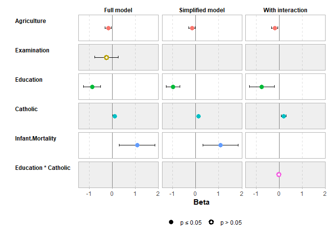

<!-- README.md is generated from README.Rmd. Please edit that file -->

# `ggstats`: extension to `ggplot2` for plotting stats

<!-- badges: start -->

[](https://lifecycle.r-lib.org/articles/stages.html#experimental)
[](https://github.com/larmarange/ggstats/actions/workflows/R-CMD-check.yaml)
[](https://app.codecov.io/gh/larmarange/ggstats?branch=main)
[](https://CRAN.R-project.org/package=ggstats)
<!-- [](https://zenodo.org/badge/latestdoi/286680847) -->
<!-- badges: end -->

The `ggstats` package provides suite of functions to plot regression
model coefficients (“forest plots”) using `ggplot2`..

The suite also includes new statistics to compute proportions, weighted
mean and cross-tabulation statistics, as well as new geometries to add
alternative background color to a plot.

The original versions of several functions were originally developed
within the `{GGally}` package.

## Installation

<!-- To install stable version:


```r
install.packages("ggstats")
```

-->

To install development version:

``` r
remotes::install_github("larmarange/ggstats")
```

## A basic example

``` r
library(ggstats)

data(tips, package = "reshape")
mod_simple <- lm(tip ~ day + time + total_bill, data = tips)
ggcoef_model(mod_simple)
```


## Comparing several models

``` r
mod1 <- lm(Fertility ~ ., data = swiss)
  mod2 <- step(mod1, trace = 0)
  mod3 <- lm(Fertility ~ Agriculture + Education * Catholic, data = swiss)
  models <- list("Full model" = mod1, "Simplified model" = mod2, "With interaction" = mod3)

  ggcoef_compare(models)
```


``` r
  ggcoef_compare(models, type = "faceted")
```


