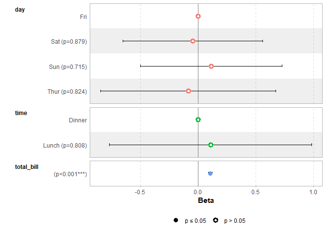
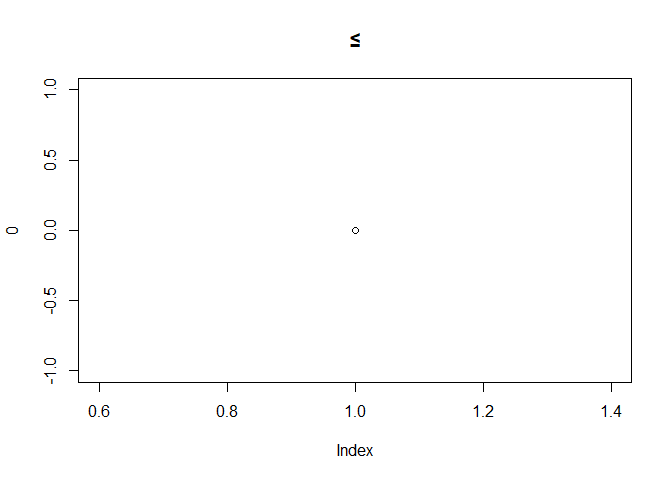
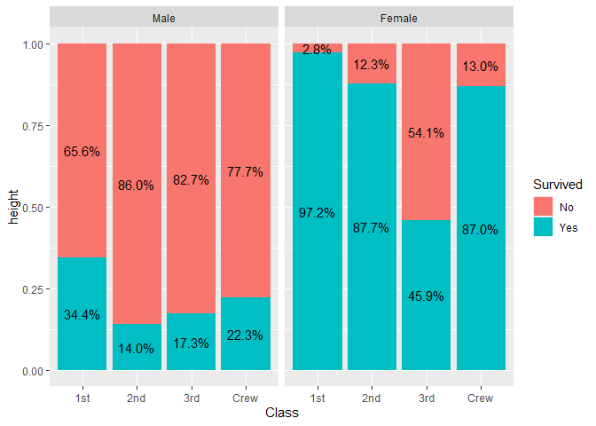
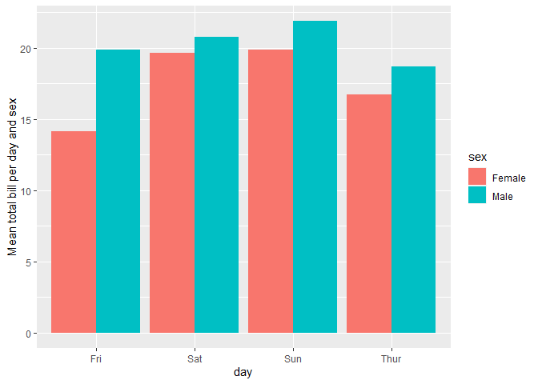
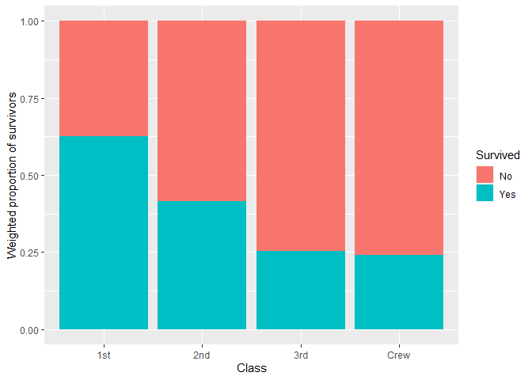

<!-- README.md is generated from README.Rmd. Please edit that file -->

# `ggstats`: extension to `ggplot2` for plotting stats

<!-- badges: start -->

[](https://lifecycle.r-lib.org/articles/stages.html#stable)
[](https://github.com/larmarange/ggstats/actions/workflows/R-CMD-check.yaml)
[](https://app.codecov.io/gh/larmarange/ggstats?branch=main)
[](https://CRAN.R-project.org/)
<!-- badges: end -->

The `ggstats` package provides suite of functions to plot regression
model coefficients (“forest plots”) using `ggplot2`..

The suite also includes new statistics to compute proportions, weighted
mean and cross-tabulation statistics, as well as new geometries to add
alternative background color to a plot.

The original versions of several functions were originally developed
within the `{GGally}` package.

## Installation

<!-- To install stable version:


```r
install.packages("ggstats")
```

-->

To install development version:

``` r
remotes::install_github("larmarange/ggstats")
```

## Plot model coefficients

``` r
library(ggstats)

mod1 <- lm(Fertility ~ ., data = swiss)
ggcoef_model(mod1)
```



## Comparing several models

``` r
mod2 <- step(mod1, trace = 0)
mod3 <- lm(Fertility ~ Agriculture + Education * Catholic, data = swiss)
models <- list(
  "Full model" = mod1, 
  "Simplified model" = mod2, 
  "With interaction" = mod3
)

ggcoef_compare(models, type = "faceted")
```



## Compute custom proportions

``` r
library(ggplot2)
ggplot(as.data.frame(Titanic)) +
  aes(x = Class, fill = Survived, weight = Freq, by = Class) +
  geom_bar(position = "fill") +
  geom_text(stat = "prop", position = position_fill(.5)) +
  facet_grid(~ Sex)
```



## Compute weighted mean

``` r
data(tips, package = "reshape")
ggplot(tips) +
  aes(x = day, y = total_bill, fill = sex) +
  stat_weighted_mean(geom = "bar", position = "dodge") +
  ylab("Mean total bill per day and sex")
```



## Compute cross-tabulation statistics

``` r
ggplot(as.data.frame(Titanic)) +
  aes(
    x = Class, y = Survived, weight = Freq,
    size = after_stat(observed), fill = after_stat(std.resid)
  ) +
  stat_cross(shape = 22) +
  scale_fill_steps2(breaks = c(-3, -2, 2, 3), show.limits = TRUE) +
  scale_size_area(max_size = 20)
```


## Plot survey objects taking into account weights

``` r
library(survey, quietly = TRUE)
#> 
#> Attaching package: 'survey'
#> The following object is masked from 'package:graphics':
#> 
#>     dotchart
dw <- svydesign(
  ids = ~ 1, 
  weights = ~ Freq, 
  data = as.data.frame(Titanic)
)
ggsurvey(dw) +
  aes(x = Class, fill = Survived) +
  geom_bar(position = "fill") +
  ylab("Weighted proportion of survivors")
```


