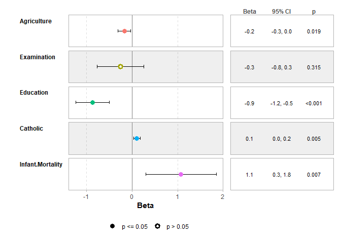

<!-- README.md is generated from README.Rmd. Please edit that file -->

# `ggstats`: extension to `ggplot2` for plotting stats

<!-- badges: start -->

[](https://lifecycle.r-lib.org/articles/stages.html#stable)
[](https://github.com/larmarange/ggstats/actions/workflows/R-CMD-check.yaml)
[](https://app.codecov.io/gh/larmarange/ggstats)
[](https://CRAN.R-project.org/package=ggstats)
[](https://zenodo.org/badge/latestdoi/547360047)
<!-- badges: end -->

The `ggstats` package provides new statistics, new geometries and new
positions for `ggplot2` and a suite of functions to facilitate the
creation of statistical plots.

## Installation & Documentation

To install **stable version**:

``` r
install.packages("ggstats")
```

Documentation of stable version: <https://larmarange.github.io/ggstats/>

To install **development version**:

``` r
remotes::install_github("larmarange/ggstats")
```

Documentation of development version:
<https://larmarange.github.io/ggstats/dev/>

## Plot model coefficients

``` r
library(ggstats)

mod1 <- lm(Fertility ~ ., data = swiss)
ggcoef_model(mod1)
```


``` r
ggcoef_table(mod1)
```



## Comparing several models

``` r
mod2 <- step(mod1, trace = 0)
mod3 <- lm(Fertility ~ Agriculture + Education * Catholic, data = swiss)
models <- list(
  "Full model" = mod1,
  "Simplified model" = mod2,
  "With interaction" = mod3
)

ggcoef_compare(models, type = "faceted")
```


## Compute custom proportions

``` r
library(ggplot2)
ggplot(as.data.frame(Titanic)) +
  aes(x = Class, fill = Survived, weight = Freq, by = Class) +
  geom_bar(position = "fill") +
  geom_text(stat = "prop", position = position_fill(.5)) +
  facet_grid(~Sex)
```


## Compute weighted mean

``` r
data(tips, package = "reshape")
ggplot(tips) +
  aes(x = day, y = total_bill, fill = sex) +
  stat_weighted_mean(geom = "bar", position = "dodge") +
  ylab("Mean total bill per day and sex")
```


## Compute cross-tabulation statistics

``` r
ggplot(as.data.frame(Titanic)) +
  aes(
    x = Class, y = Survived, weight = Freq,
    size = after_stat(observed), fill = after_stat(std.resid)
  ) +
  stat_cross(shape = 22) +
  scale_fill_steps2(breaks = c(-3, -2, 2, 3), show.limits = TRUE) +
  scale_size_area(max_size = 20)
```


## Plot survey objects taking into account weights

``` r
library(survey, quietly = TRUE)
#> 
#> Attachement du package : 'survey'
#> L'objet suivant est masqué depuis 'package:graphics':
#> 
#>     dotchart
dw <- svydesign(
  ids = ~1,
  weights = ~Freq,
  data = as.data.frame(Titanic)
)
ggsurvey(dw) +
  aes(x = Class, fill = Survived) +
  geom_bar(position = "fill") +
  ylab("Weighted proportion of survivors")
```


## Plot Likert-type items

``` r
library(dplyr)
#> 
#> Attachement du package : 'dplyr'
#> Les objets suivants sont masqués depuis 'package:stats':
#> 
#>     filter, lag
#> Les objets suivants sont masqués depuis 'package:base':
#> 
#>     intersect, setdiff, setequal, union
likert_levels <- c(
  "Strongly disagree",
  "Disagree",
  "Neither agree nor disagree",
  "Agree",
  "Strongly agree"
)
set.seed(42)
df <-
  tibble(
    q1 = sample(likert_levels, 150, replace = TRUE),
    q2 = sample(likert_levels, 150, replace = TRUE, prob = 5:1),
    q3 = sample(likert_levels, 150, replace = TRUE, prob = 1:5),
    q4 = sample(likert_levels, 150, replace = TRUE, prob = 1:5),
    q5 = sample(c(likert_levels, NA), 150, replace = TRUE),
    q6 = sample(likert_levels, 150, replace = TRUE, prob = c(1, 0, 1, 1, 0))
  ) |>
  mutate(across(everything(), ~ factor(.x, levels = likert_levels)))

gglikert(df)
```


## Connect bars

``` r
ggplot(diamonds) +
  aes(x = clarity, fill = cut) +
  geom_bar(width = .5) +
  geom_bar_connector(width = .5, linewidth = .25) +
  theme_minimal() +
  theme(legend.position = "bottom")
```


## Generate a cascade plot

``` r
diamonds |>
  ggcascade(
    all = TRUE,
    big = carat > .5,
    "big & ideal" = carat > .5 & cut == "Ideal"
  )
```


