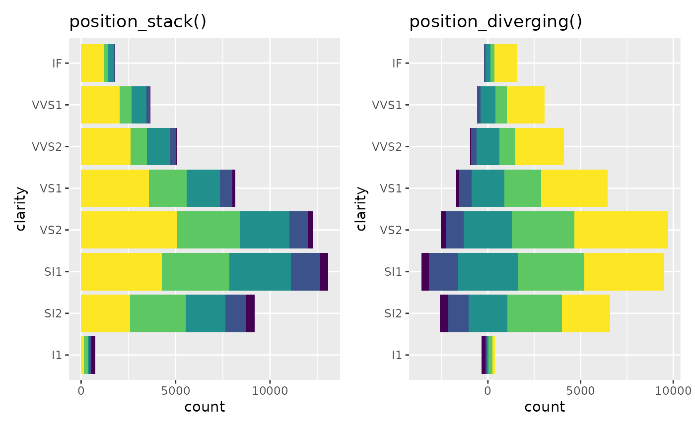
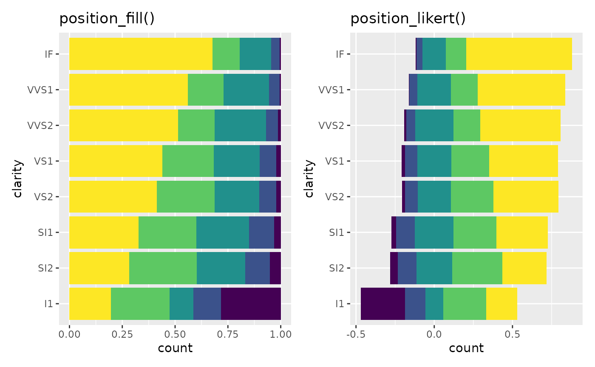
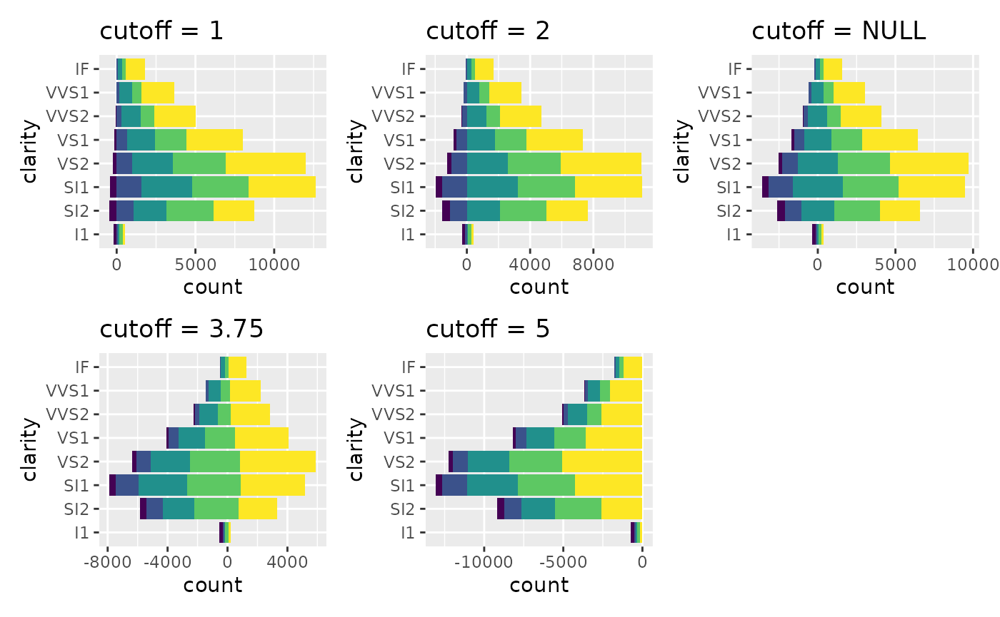
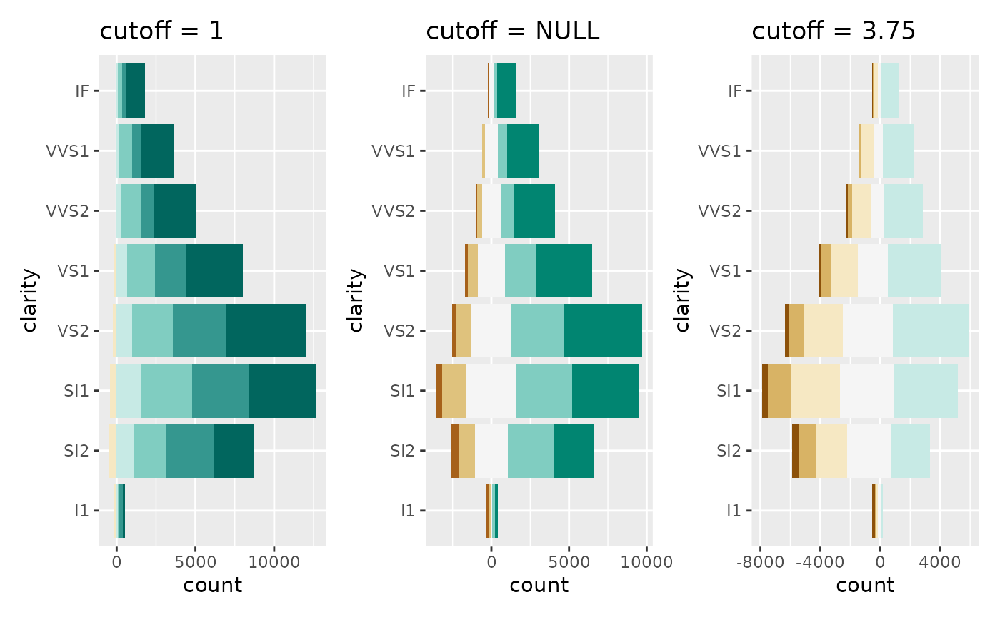
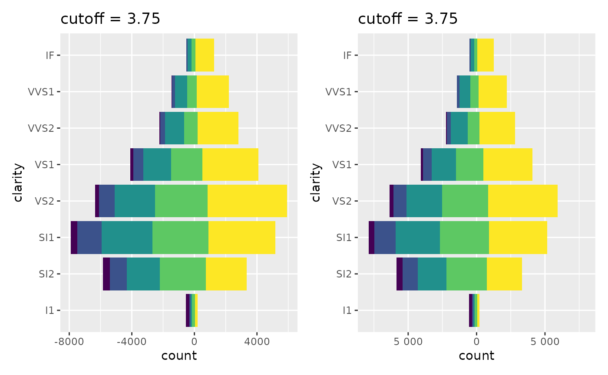
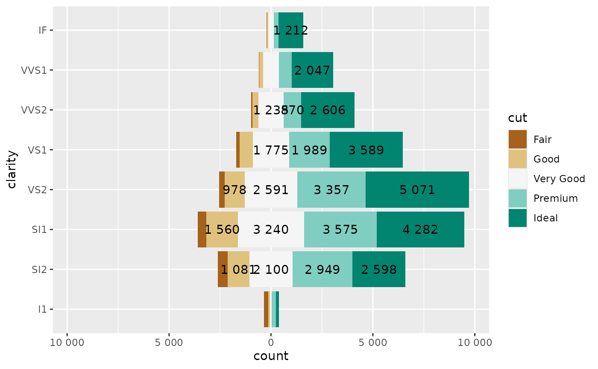
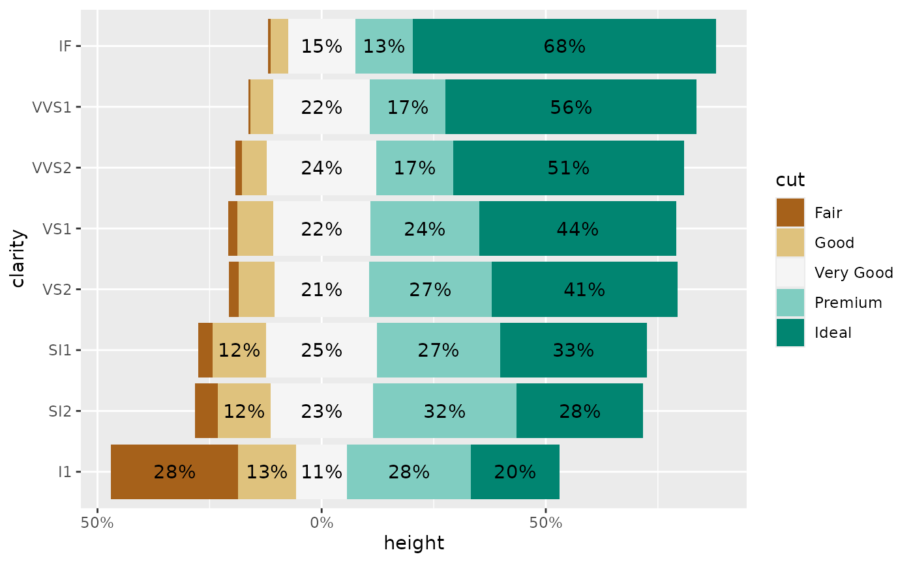
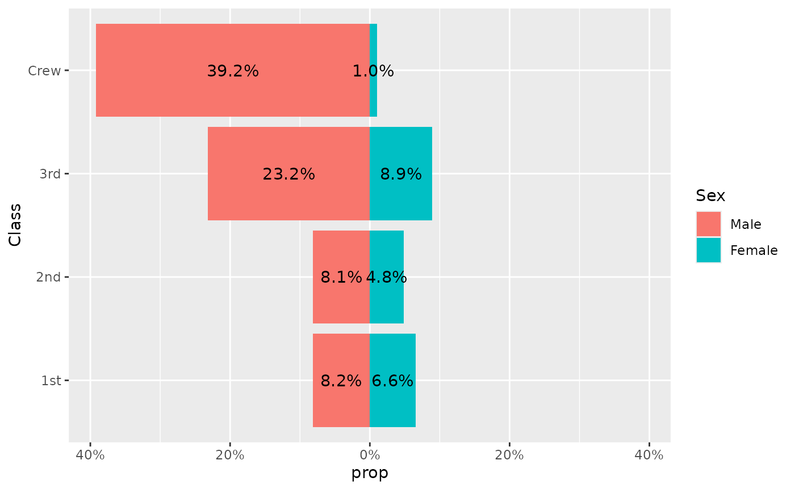

# Geometries for diverging bar plots

``` r
library(ggstats)
library(dplyr)
#> 
#> Attaching package: 'dplyr'
#> The following objects are masked from 'package:stats':
#> 
#>     filter, lag
#> The following objects are masked from 'package:base':
#> 
#>     intersect, setdiff, setequal, union
library(ggplot2)
library(patchwork)
```

*Note :* if you are looking for an all-in-one function to display
Likert-type items, please refer to
[`gglikert()`](https://larmarange.github.io/ggstats/reference/gglikert.md)
and
[`vignette("gglikert")`](https://larmarange.github.io/ggstats/articles/gglikert.md).

## New positions

Diverging bar plots could be achieved using
[`position_diverging()`](https://larmarange.github.io/ggstats/reference/position_likert.md)
or
[`position_likert()`](https://larmarange.github.io/ggstats/reference/position_likert.md).

[`position_diverging()`](https://larmarange.github.io/ggstats/reference/position_likert.md)
stacks bars on top of each other and centers them around zero (the same
number of categories are displayed on each side).

``` r
base <-
  ggplot(diamonds) +
  aes(y = clarity, fill = cut) +
  theme(legend.position = "none")

p_stack <-
  base +
  geom_bar(position = "stack") +
  ggtitle("position_stack()")

p_diverging <-
  base +
  geom_bar(position = "diverging") +
  ggtitle("position_diverging()")

p_stack + p_diverging
```



[`position_likert()`](https://larmarange.github.io/ggstats/reference/position_likert.md)
is similar but uses proportions instead of counts.

``` r
p_fill <-
  base +
  geom_bar(position = "fill") +
  ggtitle("position_fill()")

p_likert <-
  base +
  geom_bar(position = "likert") +
  ggtitle("position_likert()")

p_fill + p_likert
```



By default, the same number of categories is displayed on each side,
i.e. if you have 4 categories, 2 will be displayed negatively and 2
positively. If you have an odd number of categories, half of the central
category will be displayed negatively and half positively.

The “center” could be changed with the `cutoff` argument, representing
the number of categories to be displayed negatively: `2` to display
negatively the two first categories, `2.5` to display negatively the two
first categories and half of the third, `2.2` to display negatively the
two first categories and a fifth of the third.

``` r
p_1 <-
  base +
  geom_bar(position = position_diverging(cutoff = 1)) +
  ggtitle("cutoff = 1")

p_2 <-
  base +
  geom_bar(position = position_diverging(cutoff = 2)) +
  ggtitle("cutoff = 2")

p_null <-
  base +
  geom_bar(position = position_diverging(cutoff = NULL)) +
  ggtitle("cutoff = NULL")

p_3.75 <-
  base +
  geom_bar(position = position_diverging(cutoff = 3.75)) +
  ggtitle("cutoff = 3.75")

p_5 <-
  base +
  geom_bar(position = position_diverging(cutoff = 5)) +
  ggtitle("cutoff = 5")

wrap_plots(p_1, p_2, p_null, p_3.75, p_5)
```



## New scales

For a diverging bar plot, it is recommended to use a diverging palette,
as provided in the Brewer palettes. Sometimes, the number of available
colors is insufficient in the palette. In that case, you could use
[`pal_extender()`](https://larmarange.github.io/ggstats/reference/pal_extender.md)
or
[`scale_fill_extended()`](https://larmarange.github.io/ggstats/reference/pal_extender.md).
However, if you use a custom `cutoff`, it is also important to change
the center of the palette as well.

Therefore, for diverging bar plots, we recommend to use
[`scale_fill_likert()`](https://larmarange.github.io/ggstats/reference/scale_fill_likert.md).

``` r
wrap_plots(
  p_1 + scale_fill_likert(cutoff = 1),
  p_null + scale_fill_likert(),
  p_3.75 + scale_fill_likert(cutoff = 3.75)
)
```



## Improving axes

You may also want have centered axes. That could be easily achieved with
[`symmetric_limits()`](https://larmarange.github.io/ggstats/reference/symmetric_limits.md).

You could also use
[`label_number_abs()`](https://larmarange.github.io/ggstats/reference/label_number_abs.md)
or
[`label_percent_abs()`](https://larmarange.github.io/ggstats/reference/label_number_abs.md)
to display absolute numbers.

``` r
wrap_plots(
  p_3.75,
  p_3.75 +
    scale_x_continuous(
      limits = symmetric_limits,
      labels = label_number_abs()
    )
)
```



## New geometries

To facilitate the creation of diverging bar plots, you could use
variants of
[`geom_bar()`](https://ggplot2.tidyverse.org/reference/geom_bar.html)
and
[`geom_text()`](https://ggplot2.tidyverse.org/reference/geom_text.html).

### geom_diverging() & geom_diverging_text()

Let’s consider the following plot:

``` r
ggplot(diamonds) +
  aes(y = clarity, fill = cut) +
  geom_bar(position = "diverging") +
  geom_text(
    aes(
      label =
        label_number_abs(hide_below = 800)
        (after_stat(count))
    ),
    stat = "count",
    position = position_diverging(.5)
  ) +
  scale_fill_likert() +
  scale_x_continuous(
    labels = label_number_abs(),
    limits = symmetric_limits
  )
```


The same could be achieved quicker with
[`geom_diverging()`](https://larmarange.github.io/ggstats/reference/geom_diverging.md)
and
[`geom_diverging_text()`](https://larmarange.github.io/ggstats/reference/geom_diverging.md).

``` r
ggplot(diamonds) +
  aes(y = clarity, fill = cut) +
  geom_diverging() +
  geom_diverging_text(
    aes(
      label =
        label_number_abs(hide_below = 800)
        (after_stat(count))
    )
  ) +
  scale_fill_likert() +
  scale_x_continuous(
    labels = label_number_abs(),
    limits = symmetric_limits
  )
```



### geom_likert() & geom_likert_text()

[`geom_likert()`](https://larmarange.github.io/ggstats/reference/geom_diverging.md)
and
[`geom_likert_text()`](https://larmarange.github.io/ggstats/reference/geom_diverging.md)
works similarly.
[`geom_likert_text()`](https://larmarange.github.io/ggstats/reference/geom_diverging.md)
takes advantages of
[`stat_prop()`](https://larmarange.github.io/ggstats/reference/stat_prop.md)
for computing the proportions to be displayed (see
[`vignette("stat_prop")`](https://larmarange.github.io/ggstats/articles/stat_prop.md)).

``` r
ggplot(diamonds) +
  aes(y = clarity, fill = cut) +
  geom_likert() +
  geom_likert_text() +
  scale_fill_likert() +
  scale_x_continuous(
    labels = label_percent_abs()
  )
```



### geom_pyramid() & geom_pyramid_text()

Finally,
[`geom_pyramid()`](https://larmarange.github.io/ggstats/reference/geom_diverging.md)
and
[`geom_pyramid_text()`](https://larmarange.github.io/ggstats/reference/geom_diverging.md)
are variations adapted to display an age-sex pyramid. It uses
proportions of the total.

``` r
d <- Titanic |> as.data.frame()
ggplot(d) +
  aes(y = Class, fill = Sex, weight = Freq) +
  geom_pyramid() +
  geom_pyramid_text() +
  scale_x_continuous(
    labels = label_percent_abs(),
    limits = symmetric_limits
  )
```


