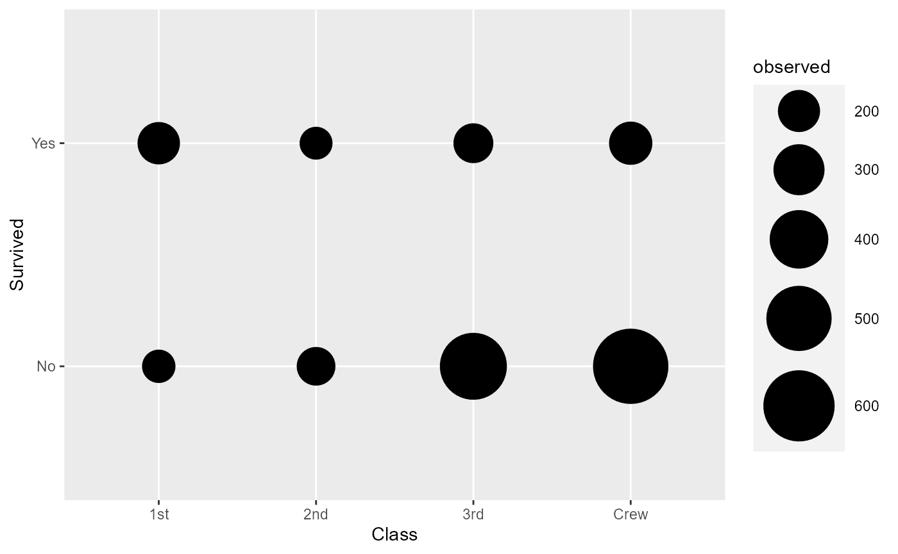
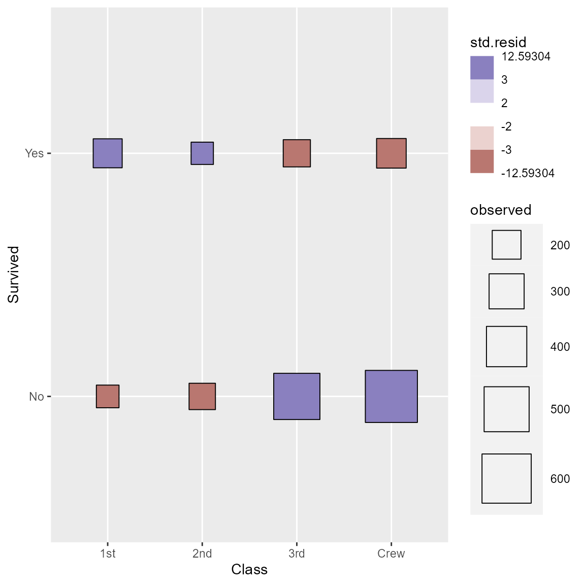
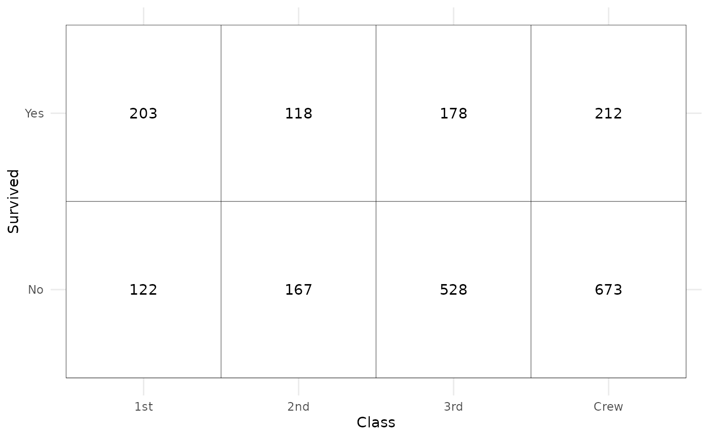
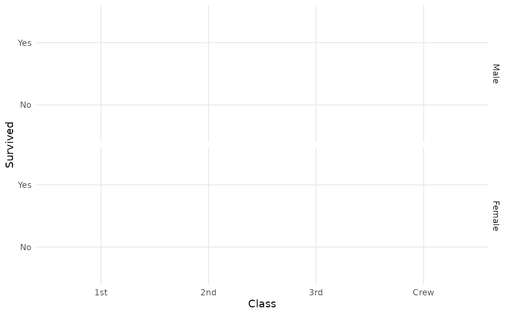

# Compute cross-tabulation statistics with \`stat_cross()\`

``` r
library(ggstats)
library(ggplot2)
```

This statistic is intended to be used with two discrete variables mapped
to **x** and **y** aesthetics. It will compute several statistics of a
cross-tabulated table using `broom::tidy.test()` and
[`stats::chisq.test()`](https://rdrr.io/r/stats/chisq.test.html). More
precisely, the computed variables are:

- **observed**: number of observations in x,y
- **prop**: proportion of total
- **row.prop**: row proportion
- **col.prop**: column proportion
- **expected**: expected count under the null hypothesis
- **resid**: Pearson’s residual
- **std.resid**: standardized residual
- **row.observed**: total number of observations within row
- **col.observed**: total number of observations within column
- **total.observed**: total number of observations within the table
- **phi**: phi coefficients, see
  [`augment_chisq_add_phi()`](https://larmarange.github.io/ggstats/reference/augment_chisq_add_phi.md)

By default,
[`stat_cross()`](https://larmarange.github.io/ggstats/reference/stat_cross.md)
is using `ggplot2::geom_points()`. If you want to plot the number of
observations, you need to map `after_stat(observed)` to an aesthetic
(here **size**):

``` r
d <- as.data.frame(Titanic)
ggplot(d) +
  aes(x = Class, y = Survived, weight = Freq, size = after_stat(observed)) +
  stat_cross() +
  scale_size_area(max_size = 20)
```



Note that the **weight** aesthetic is taken into account by
[`stat_cross()`](https://larmarange.github.io/ggstats/reference/stat_cross.md).

We can go further using a custom shape and filling points with
standardized residual to identify visually cells who are over- or
underrepresented.

``` r
ggplot(d) +
  aes(
    x = Class, y = Survived, weight = Freq,
    size = after_stat(observed), fill = after_stat(std.resid)
  ) +
  stat_cross(shape = 22) +
  scale_fill_steps2(breaks = c(-3, -2, 2, 3), show.limits = TRUE) +
  scale_size_area(max_size = 20)
```



We can easily recreate a cross-tabulated table.

``` r
ggplot(d) +
  aes(x = Class, y = Survived, weight = Freq) +
  geom_tile(fill = "white", colour = "black") +
  geom_text(stat = "cross", mapping = aes(label = after_stat(observed))) +
  theme_minimal()
```



Even more complicated, we want to produce a table showing column
proportions and where cells are filled with standardized residuals. Note
that
[`stat_cross()`](https://larmarange.github.io/ggstats/reference/stat_cross.md)
could be used with facets. In that case, computation is done separately
in each facet.

``` r
ggplot(d) +
  aes(
    x = Class, y = Survived, weight = Freq,
    label = scales::percent(after_stat(col.prop), accuracy = .1),
    fill = after_stat(std.resid)
  ) +
  stat_cross(shape = 22, size = 30) +
  geom_text(stat = "cross") +
  scale_fill_steps2(breaks = c(-3, -2, 2, 3), show.limits = TRUE) +
  facet_grid(rows = vars(Sex)) +
  labs(fill = "Standardized residuals") +
  theme_minimal()
```


