# Plot model coefficients with \`ggcoef_model()\`

``` r
library(ggstats)
```

The purpose of
[`ggcoef_model()`](https://larmarange.github.io/ggstats/dev/reference/ggcoef_model.md)
is to quickly plot the coefficients of a model. It is an updated and
improved version of `GGally::ggcoef()` based on
[`broom.helpers::tidy_plus_plus()`](https://larmarange.github.io/broom.helpers/reference/tidy_plus_plus.html).
For displaying a nicely formatted table of the same models, look at
[`gtsummary::tbl_regression()`](https://www.danieldsjoberg.com/gtsummary/reference/tbl_regression.html).

## Quick coefficients plot

To work automatically, this function requires the
[broom.helpers](https://larmarange.github.io/broom.helpers/). Simply
call
[`ggcoef_model()`](https://larmarange.github.io/ggstats/dev/reference/ggcoef_model.md)
with a model object. It could be the result of
[`stats::lm`](https://rdrr.io/r/stats/lm.html),
[`stats::glm`](https://rdrr.io/r/stats/glm.html) or any other model
covered by [broom.helpers](https://larmarange.github.io/broom.helpers/).

``` r
data(tips, package = "reshape")
mod_simple <- lm(tip ~ day + time + total_bill, data = tips)
ggcoef_model(mod_simple)
```

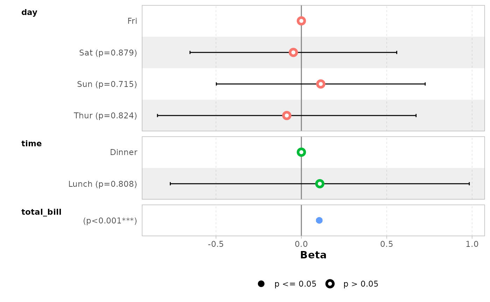

In the case of a logistic regression (or any other model for which
coefficients are usually exponentiated), simply indicated
`exponentiate = TRUE`. Note that a logarithmic scale will be used for
the x-axis.

``` r
d_titanic <- as.data.frame(Titanic)
d_titanic$Survived <- factor(d_titanic$Survived, c("No", "Yes"))
mod_titanic <- glm(
  Survived ~ Sex * Age + Class,
  weights = Freq,
  data = d_titanic,
  family = binomial
)
ggcoef_model(mod_titanic, exponentiate = TRUE)
```


## Customizing the plot

### Variable labels

You can use the [labelled](https://larmarange.github.io/labelled/)
package to define variable labels. They will be automatically used by
[`ggcoef_model()`](https://larmarange.github.io/ggstats/dev/reference/ggcoef_model.md).
Note that variable labels should be defined before computing the model.

``` r
library(labelled)
tips_labelled <- tips |>
  set_variable_labels(
    day = "Day of the week",
    time = "Lunch or Dinner",
    total_bill = "Bill's total"
  )
mod_labelled <- lm(tip ~ day + time + total_bill, data = tips_labelled)
ggcoef_model(mod_labelled)
```

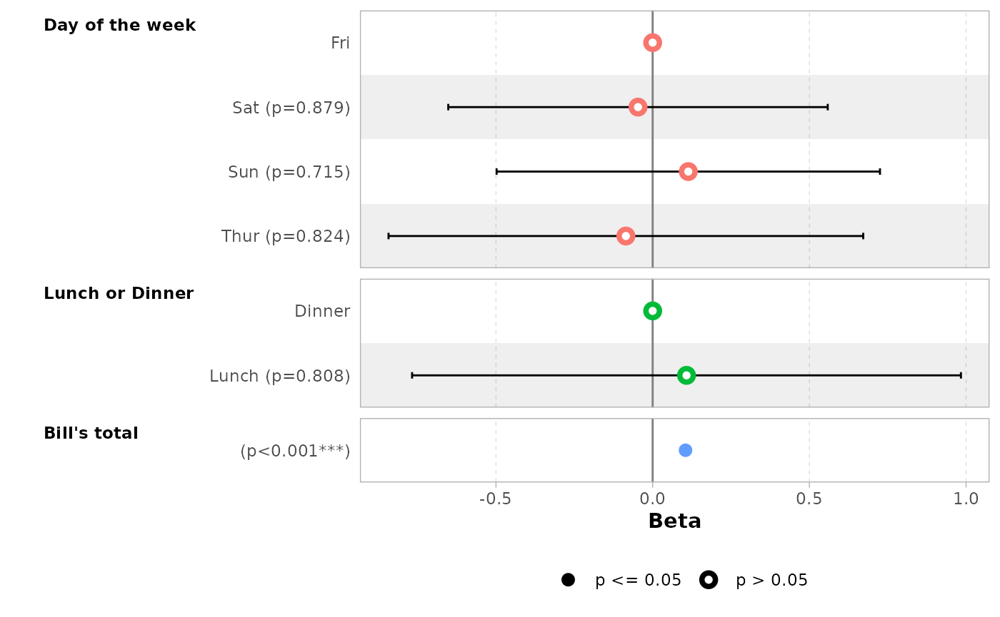

You can also define custom variable labels directly by passing a named
vector to the `variable_labels` option.

``` r
ggcoef_model(
  mod_simple,
  variable_labels = c(
    day = "Week day",
    time = "Time (lunch or dinner ?)",
    total_bill = "Total of the bill"
  )
)
```

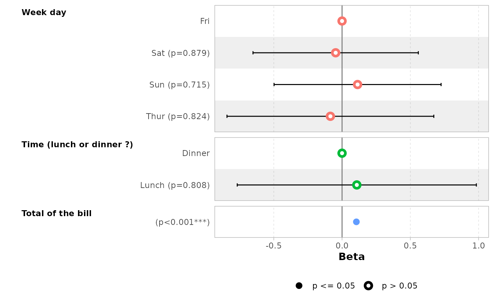

If variable labels are to long, you can pass
[`ggplot2::label_wrap_gen()`](https://ggplot2.tidyverse.org/reference/labellers.html)
or any other labeller function to `facet_labeller.`

``` r
ggcoef_model(
  mod_simple,
  variable_labels = c(
    day = "Week day",
    time = "Time (lunch or dinner ?)",
    total_bill = "Total of the bill"
  ),
  facet_labeller = ggplot2::label_wrap_gen(10)
)
```

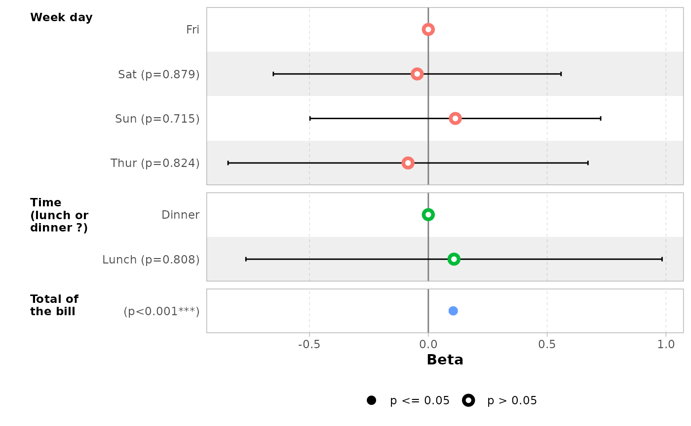

Use `facet_row = NULL` to hide variable names.

``` r
ggcoef_model(mod_simple, facet_row = NULL, colour_guide = TRUE)
```

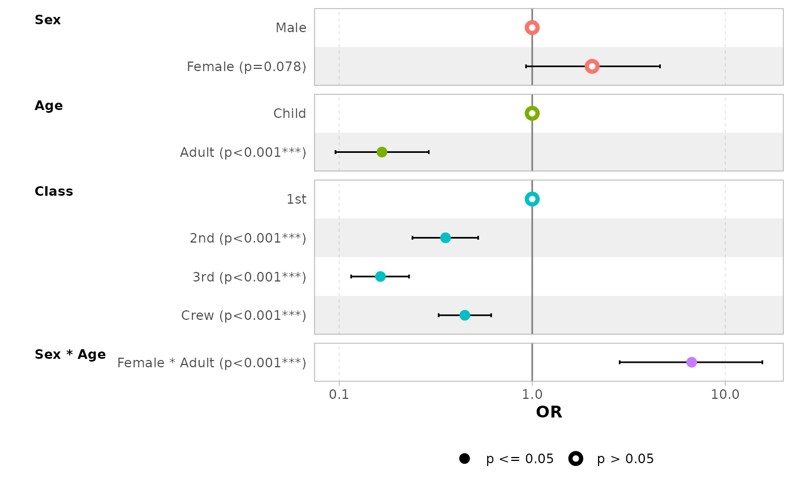

### Term labels

Several options allows you to customize term labels.

``` r
ggcoef_model(mod_titanic, exponentiate = TRUE)
```

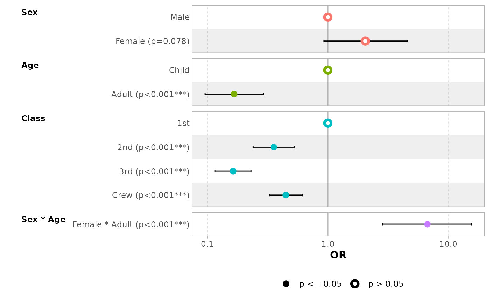

``` r
ggcoef_model(
  mod_titanic,
  exponentiate = TRUE,
  show_p_values = FALSE,
  signif_stars = FALSE,
  add_reference_rows = FALSE,
  categorical_terms_pattern = "{level} (ref: {reference_level})",
  interaction_sep = " x "
) +
  ggplot2::scale_y_discrete(labels = scales::label_wrap(15))
#> Scale for y is already present.
#> Adding another scale for y, which will replace the existing scale.
```

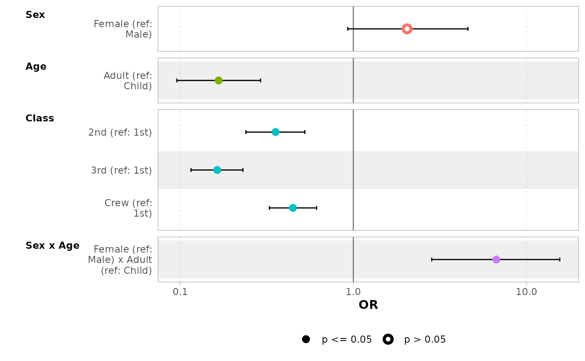

By default, for categorical variables using treatment and sum contrasts,
reference rows will be added and displayed on the graph.

``` r
mod_titanic2 <- glm(
  Survived ~ Sex * Age + Class,
  weights = Freq,
  data = d_titanic,
  family = binomial,
  contrasts = list(Sex = contr.sum, Class = contr.treatment(4, base = 3))
)
ggcoef_model(mod_titanic2, exponentiate = TRUE)
```


Continuous variables with polynomial terms defined with
[`stats::poly()`](https://rdrr.io/r/stats/poly.html) are also properly
managed.

``` r
mod_poly <- lm(Sepal.Length ~ poly(Petal.Width, 3) + Petal.Length, data = iris)
ggcoef_model(mod_poly)
```

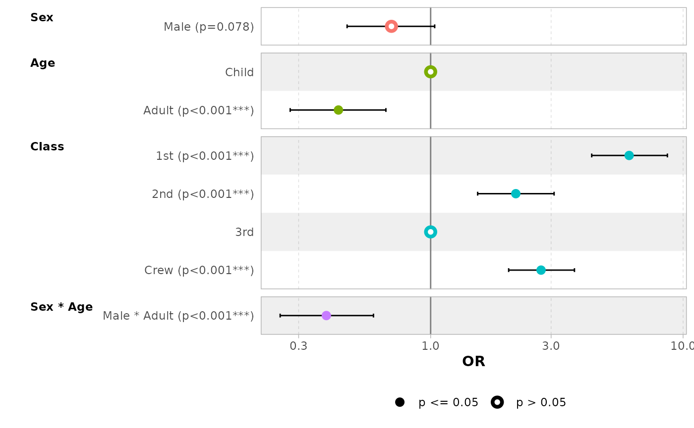

Use `no_reference_row` to indicate which variables should not have a
reference row added.

``` r
ggcoef_model(
  mod_titanic2,
  exponentiate = TRUE,
  no_reference_row = "Sex"
)
```

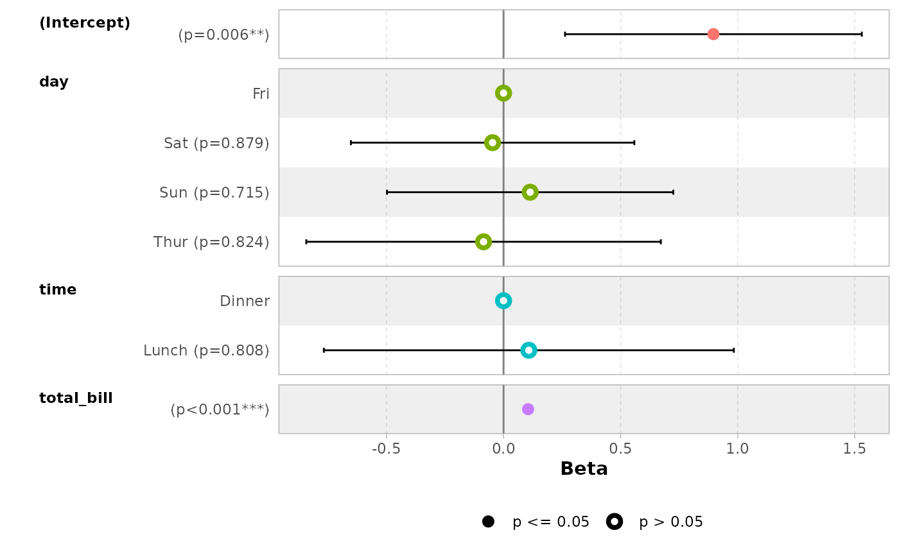

``` r
ggcoef_model(
  mod_titanic2,
  exponentiate = TRUE,
  no_reference_row = broom.helpers::all_dichotomous()
)
```

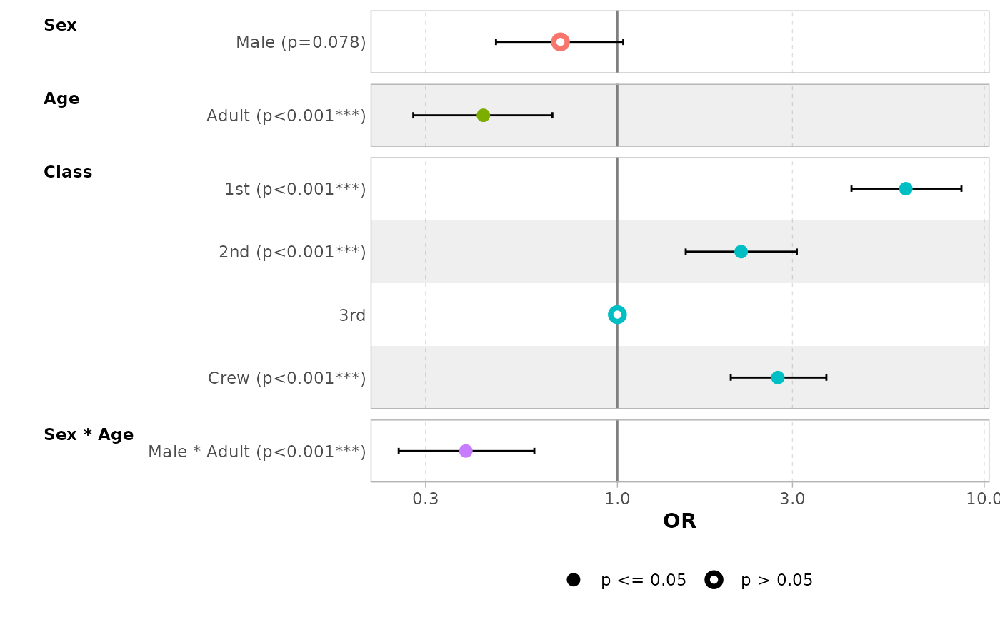

``` r
ggcoef_model(
  mod_titanic2,
  exponentiate = TRUE,
  no_reference_row = broom.helpers::all_categorical(),
  categorical_terms_pattern = "{level}/{reference_level}"
)
```

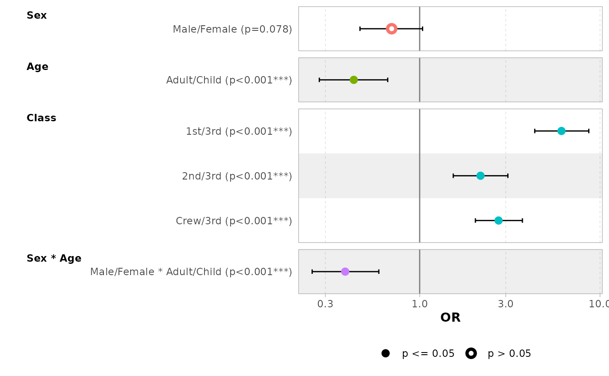

### Elements to display

Use `intercept = TRUE` to display intercepts.

``` r
ggcoef_model(mod_simple, intercept = TRUE)
```

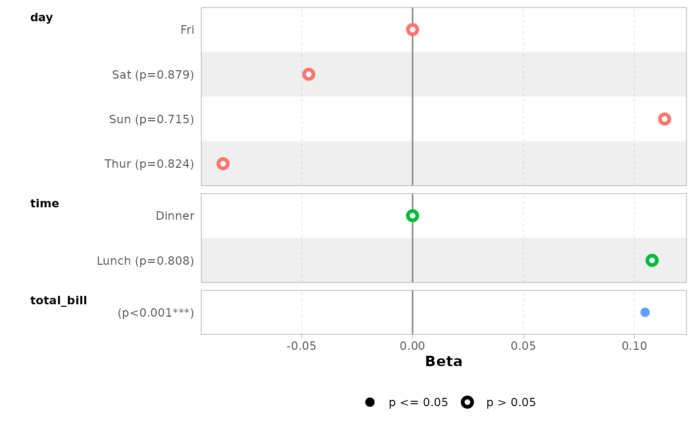

You can remove confidence intervals with `conf.int = FALSE`.

``` r
ggcoef_model(mod_simple, conf.int = FALSE)
```

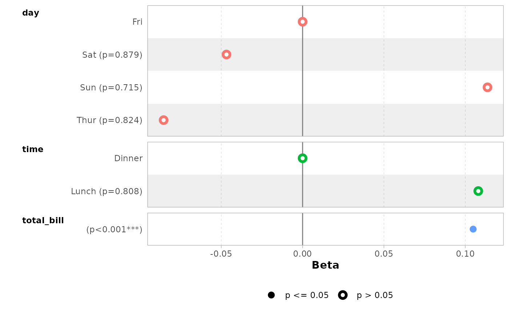

By default, significant terms (i.e. with a p-value below 5%) are
highlighted using two types of dots. You can control the level of
significance with `significance` or remove it with
`significance = NULL`.

``` r
ggcoef_model(mod_simple, significance = NULL)
```

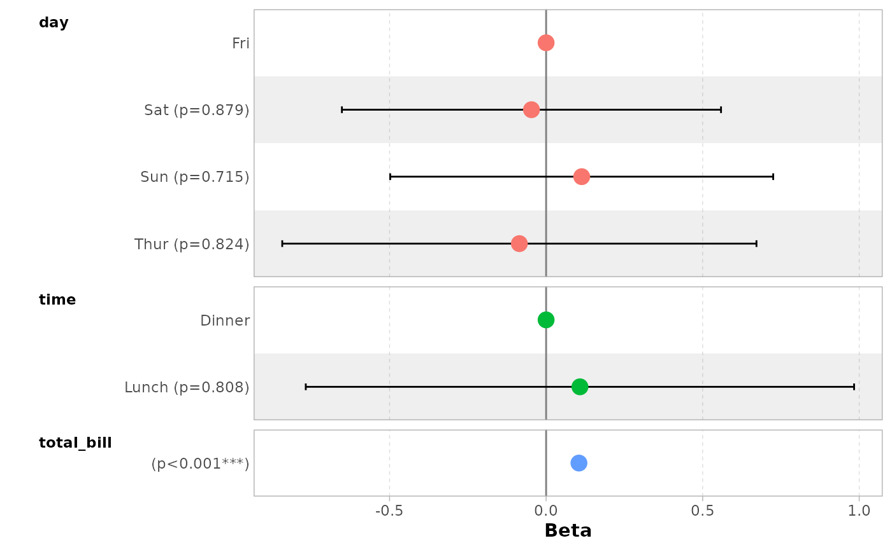

By default, dots are colored by variable. You can deactivate this
behavior with `colour = NULL`.

``` r
ggcoef_model(mod_simple, colour = NULL)
```


You can display only a subset of terms with **include**.

``` r
ggcoef_model(mod_simple, include = c("time", "total_bill"))
```

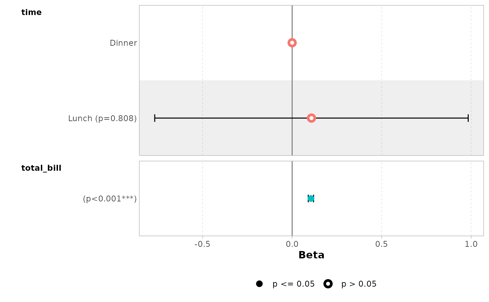

It is possible to use `tidyselect` helpers.

``` r
ggcoef_model(mod_simple, include = dplyr::starts_with("t"))
```


You can remove stripped rows with `stripped_rows = FALSE`.

``` r
ggcoef_model(mod_simple, stripped_rows = FALSE)
```

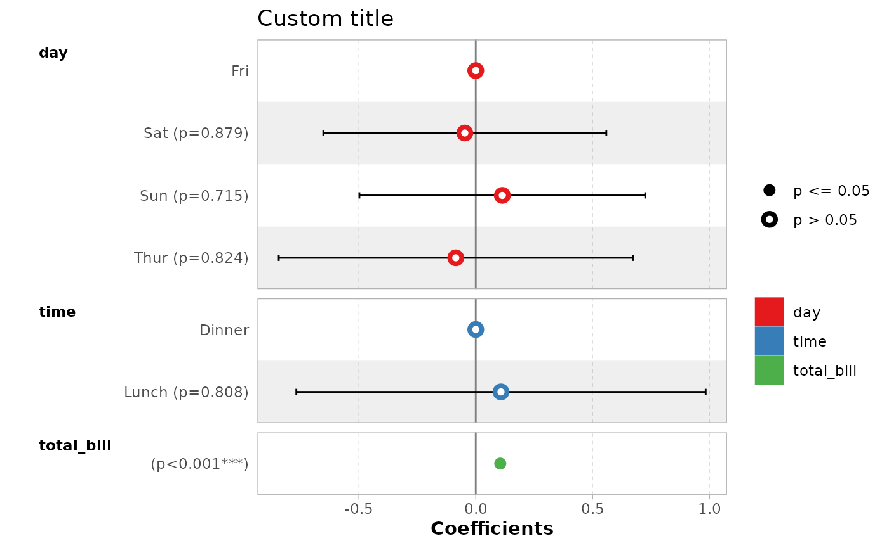

Do not hesitate to consult the help file of
[`ggcoef_model()`](https://larmarange.github.io/ggstats/dev/reference/ggcoef_model.md)
to see all available options.

### ggplot2 elements

The plot returned by
[`ggcoef_model()`](https://larmarange.github.io/ggstats/dev/reference/ggcoef_model.md)
is a classic `ggplot2` plot. You can therefore apply `ggplot2` functions
to it.

``` r
ggcoef_model(mod_simple) +
  ggplot2::xlab("Coefficients") +
  ggplot2::ggtitle("Custom title") +
  ggplot2::scale_color_brewer(palette = "Set1") +
  ggplot2::theme(legend.position = "right")
#> Scale for colour is already present.
#> Adding another scale for colour, which will replace the existing scale.
```


## Forest plot with a coefficient table

[`ggcoef_table()`](https://larmarange.github.io/ggstats/dev/reference/ggcoef_model.md)
is a variant of
[`ggcoef_model()`](https://larmarange.github.io/ggstats/dev/reference/ggcoef_model.md)
displaying a coefficient table on the right of the forest plot.

``` r
ggcoef_table(mod_simple)
```

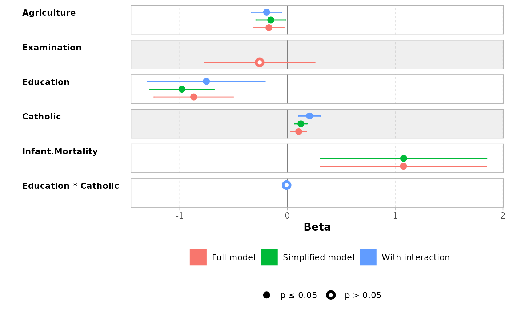

``` r
ggcoef_table(mod_titanic, exponentiate = TRUE)
```

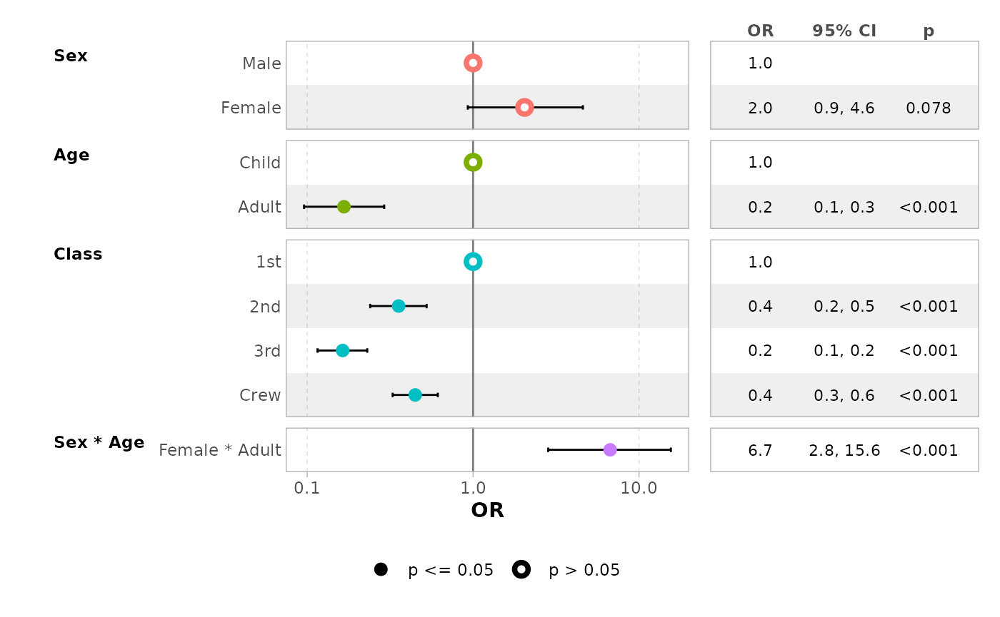

You can easily customize the columns to be displayed.

``` r
ggcoef_table(
  mod_simple,
  table_stat = c("label", "estimate", "std.error", "ci"),
  ci_pattern = "{conf.low} to {conf.high}",
  table_stat_label = list(
    estimate = scales::label_number(accuracy = .001),
    conf.low = scales::label_number(accuracy = .01),
    conf.high = scales::label_number(accuracy = .01),
    std.error = scales::label_number(accuracy = .001),
    label = toupper
  ),
  table_header = c("Term", "Coef.", "SE", "CI"),
  table_widths = c(2, 3)
)
```

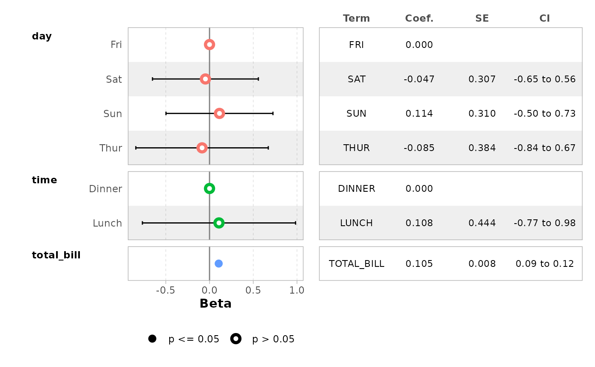

## Multinomial models

For multinomial models, simply use
[`ggcoef_model()`](https://larmarange.github.io/ggstats/dev/reference/ggcoef_model.md)
or
[`ggcoef_table()`](https://larmarange.github.io/ggstats/dev/reference/ggcoef_model.md).
Additional visualizations are available using
[`ggcoef_dodged()`](https://larmarange.github.io/ggstats/dev/reference/ggcoef_model.md)
or
[`ggcoef_faceted()`](https://larmarange.github.io/ggstats/dev/reference/ggcoef_model.md).

``` r
library(nnet)
hec <- as.data.frame(HairEyeColor)
mod <- multinom(
  Hair ~ Eye + Sex,
  data = hec,
  weights = hec$Freq
)
#> # weights:  24 (15 variable)
#> initial  value 820.686262 
#> iter  10 value 669.061500
#> iter  20 value 658.888977
#> final  value 658.885327 
#> converged
```

``` r
mod |> ggcoef_model(exponentiate = TRUE)
```

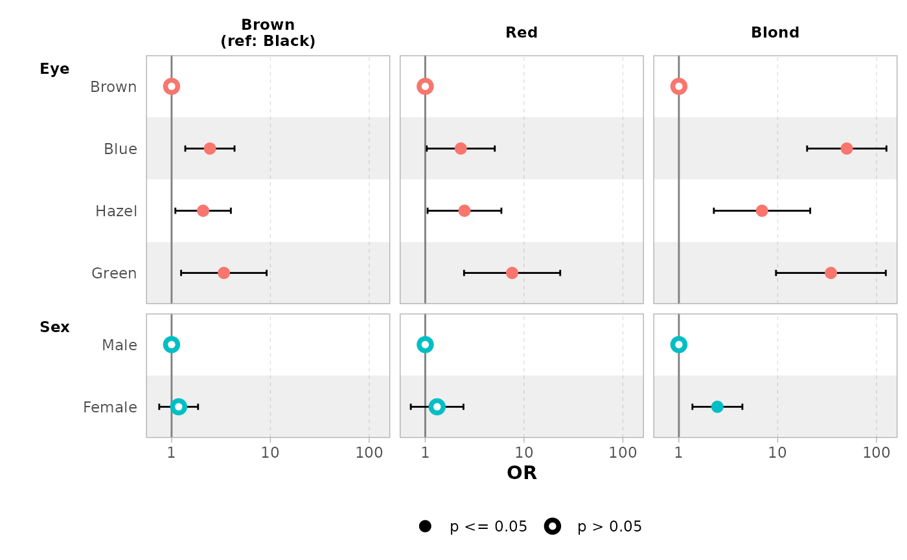

``` r
mod |> ggcoef_table(exponentiate = TRUE)
```

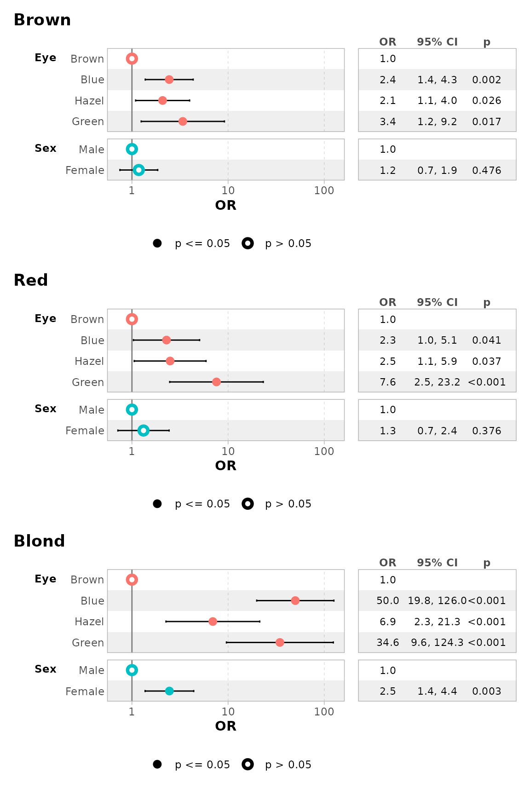

``` r
mod |> ggcoef_dodged(exponentiate = TRUE)
```


``` r
mod |> ggcoef_faceted(exponentiate = TRUE)
```

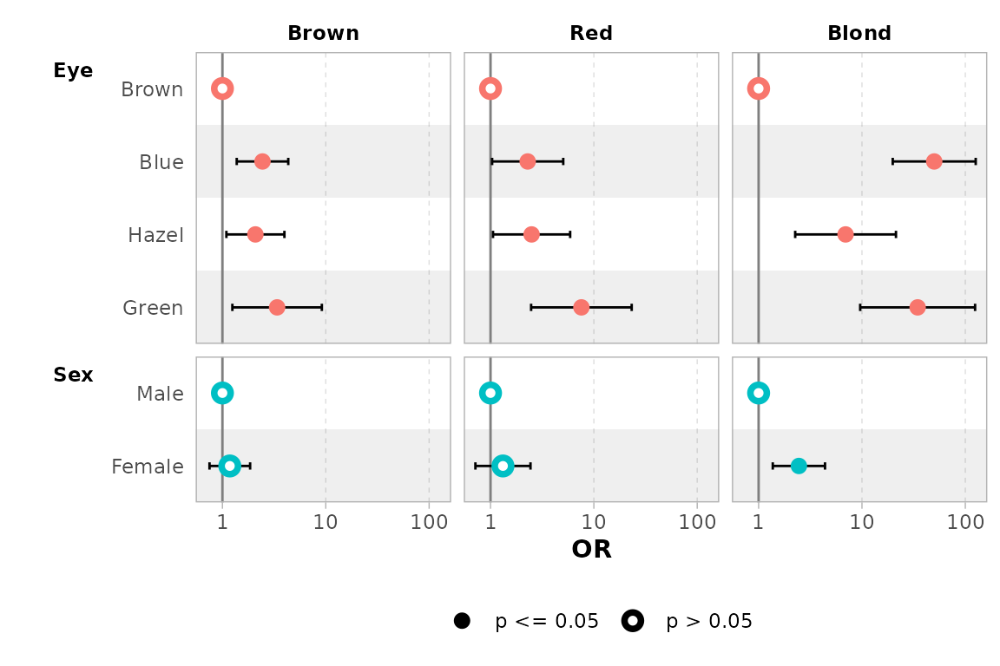

You can use `group_labels` to customize the label of each level.

``` r
mod |>
  ggcoef_faceted(
    group_labels = c("Brown" = "Brown\n(ref: Black)"),
    exponentiate = TRUE
  )
```

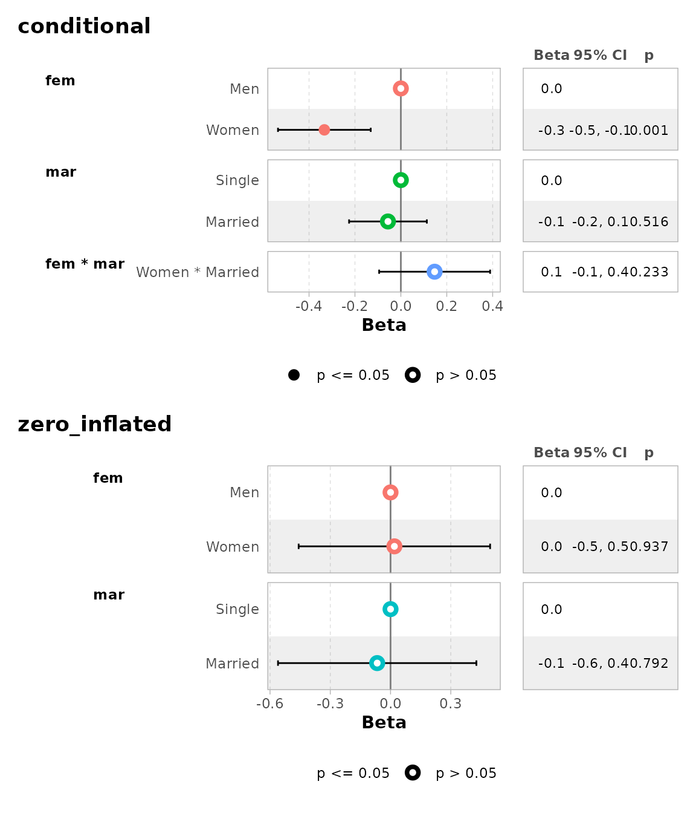

## Multi-components models

Multi-components models such as zero-inflated Poisson or beta regression
generate a set of terms for each of their components. simply use
[`ggcoef_model()`](https://larmarange.github.io/ggstats/dev/reference/ggcoef_model.md)
or
[`ggcoef_table()`](https://larmarange.github.io/ggstats/dev/reference/ggcoef_model.md).
Additional visualizations are available using
[`ggcoef_dodged()`](https://larmarange.github.io/ggstats/dev/reference/ggcoef_model.md)
or
[`ggcoef_faceted()`](https://larmarange.github.io/ggstats/dev/reference/ggcoef_model.md).

``` r
library(pscl)
#> Classes and Methods for R originally developed in the
#> Political Science Computational Laboratory
#> Department of Political Science
#> Stanford University (2002-2015),
#> by and under the direction of Simon Jackman.
#> hurdle and zeroinfl functions by Achim Zeileis.
data("bioChemists", package = "pscl")
mod <- zeroinfl(art ~ fem * mar | fem + mar, data = bioChemists)
```

``` r
mod |> ggcoef_model()
#> ℹ <zeroinfl> model detected.
#> ✔ `tidy_zeroinfl()` used instead.
#> ℹ Add `tidy_fun = broom.helpers::tidy_zeroinfl` to quiet these messages.
```

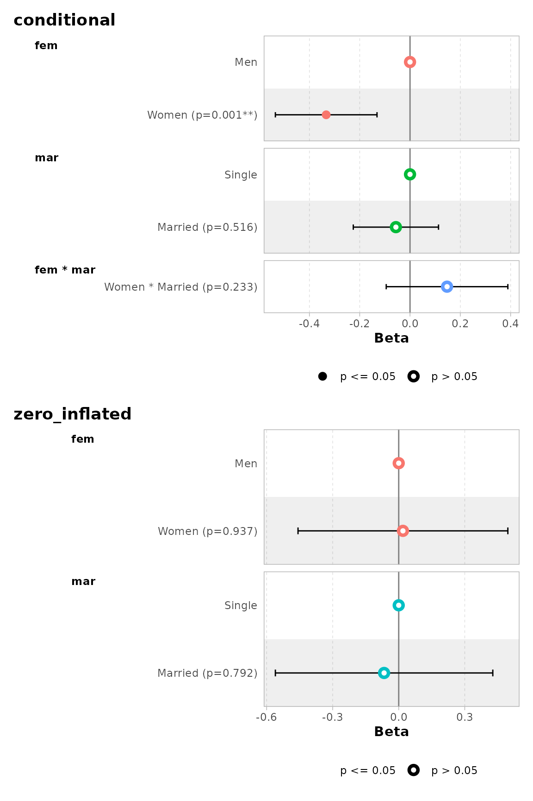

``` r
mod |> ggcoef_table()
#> ℹ <zeroinfl> model detected.
#> ✔ `tidy_zeroinfl()` used instead.
#> ℹ Add `tidy_fun = broom.helpers::tidy_zeroinfl` to quiet these messages.
```

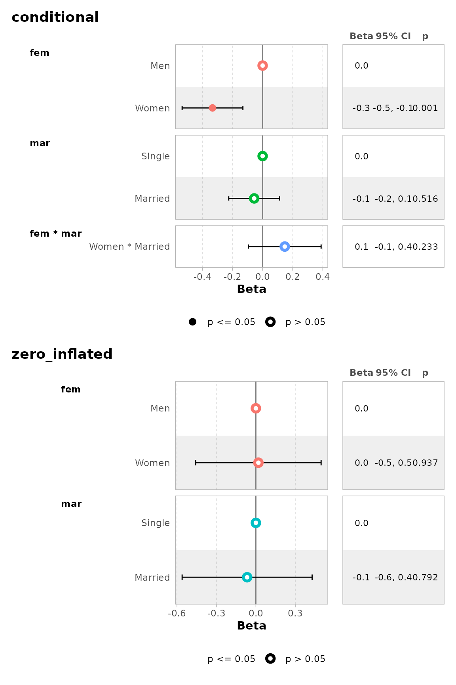

``` r
mod |> ggcoef_dodged(exponentiate = TRUE)
#> ℹ <zeroinfl> model detected.
#> ✔ `tidy_zeroinfl()` used instead.
#> ℹ Add `tidy_fun = broom.helpers::tidy_zeroinfl` to quiet these messages.
```

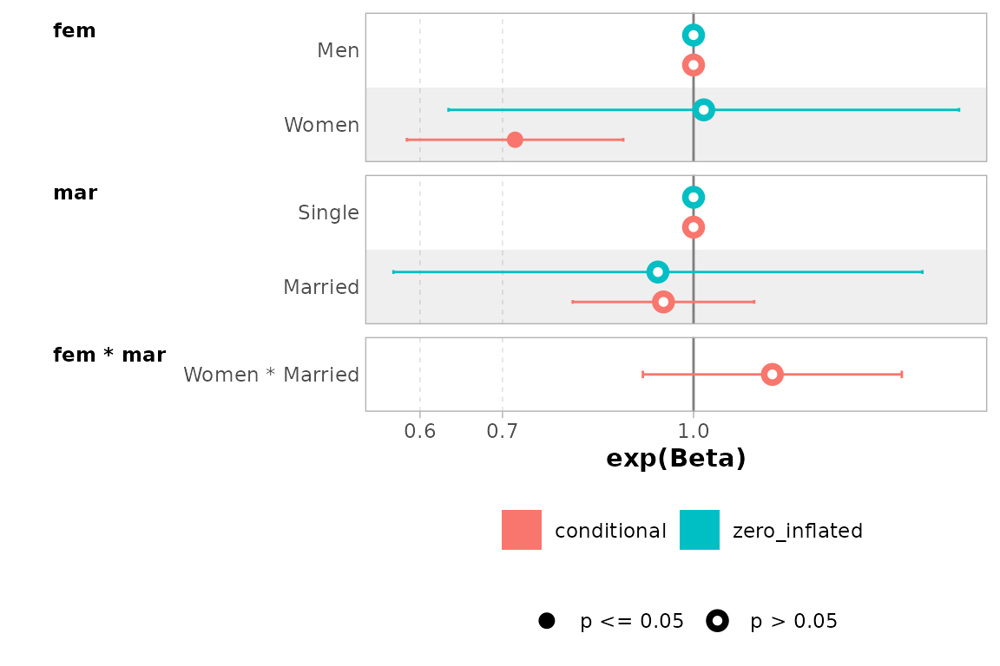

``` r
mod |> ggcoef_faceted(
  exponentiate = TRUE,
  group_labels = c(conditional = "Count", zero_inflated = "Zero-inflated")
)
#> ℹ <zeroinfl> model detected.
#> ✔ `tidy_zeroinfl()` used instead.
#> ℹ Add `tidy_fun = broom.helpers::tidy_zeroinfl` to quiet these messages.
```

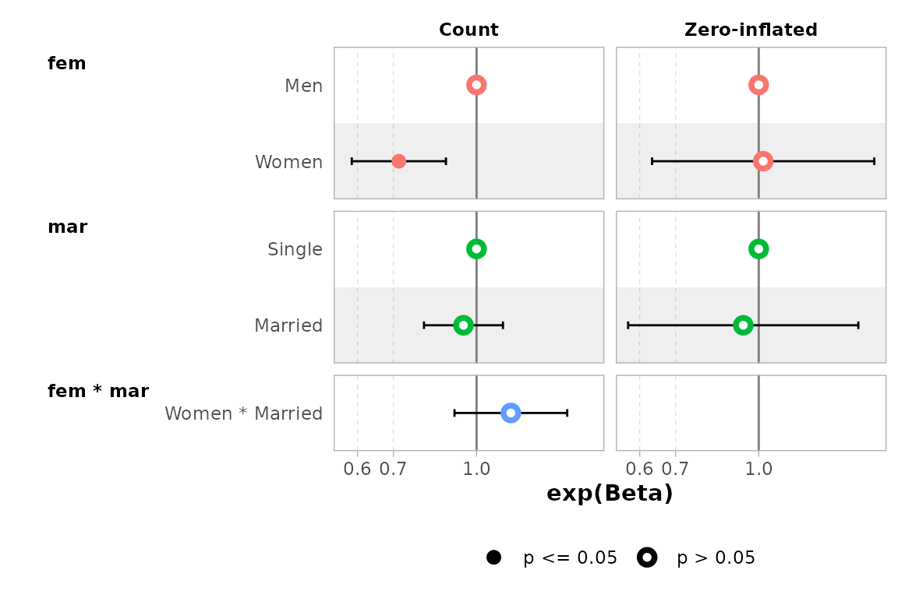

## Comparing several models

You can easily compare several models with
[`ggcoef_compare()`](https://larmarange.github.io/ggstats/dev/reference/ggcoef_model.md).
To be noted,
[`ggcoef_compare()`](https://larmarange.github.io/ggstats/dev/reference/ggcoef_model.md)
is not compatible with multinomial or multi-components models.

``` r
mod1 <- lm(Fertility ~ ., data = swiss)
mod2 <- step(mod1, trace = 0)
mod3 <- lm(Fertility ~ Agriculture + Education * Catholic, data = swiss)
models <- list(
  "Full model" = mod1,
  "Simplified model" = mod2,
  "With interaction" = mod3
)

ggcoef_compare(models)
```

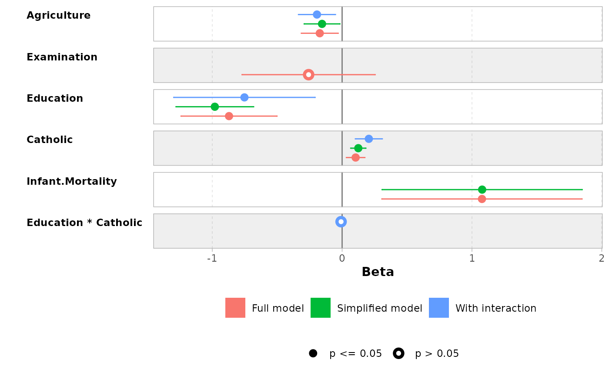

``` r
ggcoef_compare(models, type = "faceted")
```

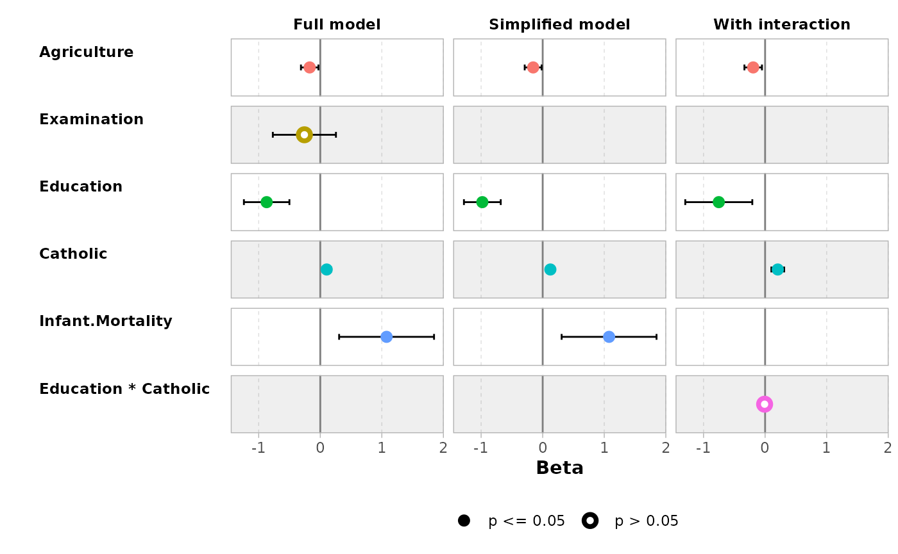

``` r
ggcoef_compare(models, type = "table")
```

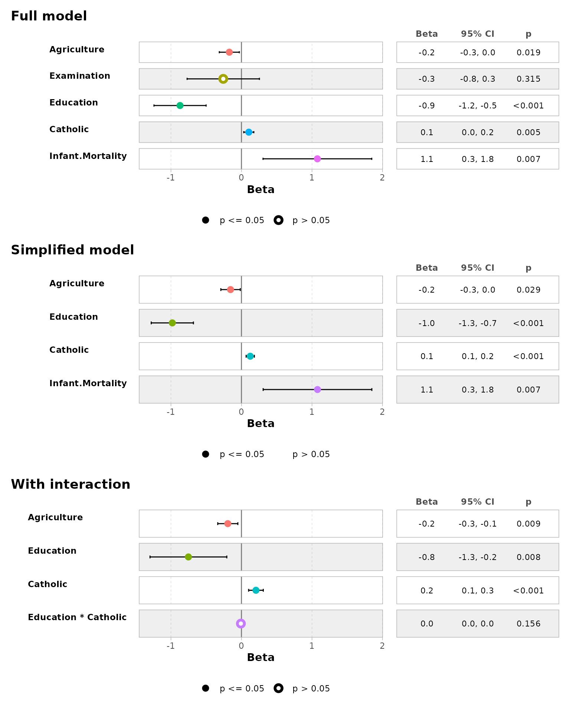

## Advanced users

Advanced users could use their own dataset and pass it to
[`ggcoef_plot()`](https://larmarange.github.io/ggstats/dev/reference/ggcoef_model.md).
Such dataset could be produced by
[`ggcoef_model()`](https://larmarange.github.io/ggstats/dev/reference/ggcoef_model.md),
[`ggcoef_dodged()`](https://larmarange.github.io/ggstats/dev/reference/ggcoef_model.md),
[`ggcoef_faceted()`](https://larmarange.github.io/ggstats/dev/reference/ggcoef_model.md)
or
[`ggcoef_compare()`](https://larmarange.github.io/ggstats/dev/reference/ggcoef_model.md)
with the option `return_data = TRUE` or by using
[`broom::tidy()`](https://generics.r-lib.org/reference/tidy.html) or
[`broom.helpers::tidy_plus_plus()`](https://larmarange.github.io/broom.helpers/reference/tidy_plus_plus.html).

## Supported models

| model                                                                  | notes                                                                                                                                                                                                                                                                       |
|:-----------------------------------------------------------------------|:----------------------------------------------------------------------------------------------------------------------------------------------------------------------------------------------------------------------------------------------------------------------------|
| [`betareg::betareg()`](https://rdrr.io/pkg/betareg/man/betareg.html)   | Use `tidy_parameters()` as `tidy_fun` with `component` argument to control with coefficients to return. [`broom::tidy()`](https://generics.r-lib.org/reference/tidy.html) does not support the `exponentiate` argument for betareg models, use `tidy_parameters()` instead. |
| `biglm::bigglm()`                                                      |                                                                                                                                                                                                                                                                             |
| `brms::brm()`                                                          | `broom.mixed` package required                                                                                                                                                                                                                                              |
| `cmprsk::crr()`                                                        | Limited support. It is recommended to use `tidycmprsk::crr()` instead.                                                                                                                                                                                                      |
| `fixest::feglm()`                                                      | May fail with R \<= 4.0.                                                                                                                                                                                                                                                    |
| `fixest::femlm()`                                                      | May fail with R \<= 4.0.                                                                                                                                                                                                                                                    |
| `fixest::feNmlm()`                                                     | May fail with R \<= 4.0.                                                                                                                                                                                                                                                    |
| `fixest::feols()`                                                      | May fail with R \<= 4.0.                                                                                                                                                                                                                                                    |
| `gam::gam()`                                                           |                                                                                                                                                                                                                                                                             |
| `geepack::geeglm()`                                                    |                                                                                                                                                                                                                                                                             |
| `glmmTMB::glmmTMB()`                                                   | `broom.mixed` package required                                                                                                                                                                                                                                              |
| `glmtoolbox::glmgee()`                                                 |                                                                                                                                                                                                                                                                             |
| `lavaan::lavaan()`                                                     | Limited support for categorical variables                                                                                                                                                                                                                                   |
| `lfe::felm()`                                                          |                                                                                                                                                                                                                                                                             |
| `lme4::glmer.nb()`                                                     | `broom.mixed` package required                                                                                                                                                                                                                                              |
| `lme4::glmer()`                                                        | `broom.mixed` package required                                                                                                                                                                                                                                              |
| `lme4::lmer()`                                                         | `broom.mixed` package required                                                                                                                                                                                                                                              |
| `logitr::logitr()`                                                     | Requires logitr \>= 0.8.0                                                                                                                                                                                                                                                   |
| [`MASS::glm.nb()`](https://rdrr.io/pkg/MASS/man/glm.nb.html)           |                                                                                                                                                                                                                                                                             |
| [`MASS::polr()`](https://rdrr.io/pkg/MASS/man/polr.html)               |                                                                                                                                                                                                                                                                             |
| [`mgcv::gam()`](https://rdrr.io/pkg/mgcv/man/gam.html)                 | Use default tidier [`broom::tidy()`](https://generics.r-lib.org/reference/tidy.html) for smooth terms only, or [`gtsummary::tidy_gam()`](https://www.danieldsjoberg.com/gtsummary/reference/custom_tidiers.html) to include parametric terms                                |
| `mice::mira`                                                           | Limited support. If `mod` is a `mira` object, use `tidy_fun = function(x, ...) {mice::pool(x) &#124;> mice::tidy(...)}`                                                                                                                                                     |
| `mmrm::mmrm()`                                                         |                                                                                                                                                                                                                                                                             |
| `multgee::nomLORgee()`                                                 | Use `tidy_multgee()` as `tidy_fun`.                                                                                                                                                                                                                                         |
| `multgee::ordLORgee()`                                                 | Use `tidy_multgee()` as `tidy_fun`.                                                                                                                                                                                                                                         |
| [`nnet::multinom()`](https://rdrr.io/pkg/nnet/man/multinom.html)       |                                                                                                                                                                                                                                                                             |
| `ordinal::clm()`                                                       | Limited support for models with nominal predictors.                                                                                                                                                                                                                         |
| `ordinal::clmm()`                                                      | Limited support for models with nominal predictors.                                                                                                                                                                                                                         |
| `parsnip::model_fit`                                                   | Supported as long as the type of model and the engine is supported.                                                                                                                                                                                                         |
| `plm::plm()`                                                           |                                                                                                                                                                                                                                                                             |
| [`pscl::hurdle()`](https://rdrr.io/pkg/pscl/man/hurdle.html)           | Use `tidy_zeroinfl()` as `tidy_fun`.                                                                                                                                                                                                                                        |
| [`pscl::zeroinfl()`](https://rdrr.io/pkg/pscl/man/zeroinfl.html)       | Use `tidy_zeroinfl()` as `tidy_fun`.                                                                                                                                                                                                                                        |
| `quantreg::rq()`                                                       | If several quantiles are estimated, use `tidy_with_broom_or_parameters()` tidier, the default tidier used by `tidy_plus_plus()`.                                                                                                                                            |
| `rstanarm::stan_glm()`                                                 | `broom.mixed` package required                                                                                                                                                                                                                                              |
| [`stats::aov()`](https://rdrr.io/r/stats/aov.html)                     | Reference rows are not relevant for such models.                                                                                                                                                                                                                            |
| [`stats::glm()`](https://rdrr.io/r/stats/glm.html)                     |                                                                                                                                                                                                                                                                             |
| [`stats::lm()`](https://rdrr.io/r/stats/lm.html)                       |                                                                                                                                                                                                                                                                             |
| [`stats::nls()`](https://rdrr.io/r/stats/nls.html)                     | Limited support                                                                                                                                                                                                                                                             |
| [`survey::svycoxph()`](https://rdrr.io/pkg/survey/man/svycoxph.html)   |                                                                                                                                                                                                                                                                             |
| [`survey::svyglm()`](https://rdrr.io/pkg/survey/man/svyglm.html)       |                                                                                                                                                                                                                                                                             |
| [`survey::svyolr()`](https://rdrr.io/pkg/survey/man/svyolr.html)       |                                                                                                                                                                                                                                                                             |
| [`survival::cch()`](https://rdrr.io/pkg/survival/man/cch.html)         | Experimental support.                                                                                                                                                                                                                                                       |
| [`survival::clogit()`](https://rdrr.io/pkg/survival/man/clogit.html)   |                                                                                                                                                                                                                                                                             |
| [`survival::coxph()`](https://rdrr.io/pkg/survival/man/coxph.html)     |                                                                                                                                                                                                                                                                             |
| [`survival::survreg()`](https://rdrr.io/pkg/survival/man/survreg.html) |                                                                                                                                                                                                                                                                             |
| `svyVGAM::svy_vglm()`                                                  | Experimental support. It is recommended to use `tidy_svy_vglm()` as `tidy_fun`.                                                                                                                                                                                             |
| `tidycmprsk::crr()`                                                    |                                                                                                                                                                                                                                                                             |
| `VGAM::vgam()`                                                         | Experimental support. It is recommended to use `tidy_vgam()` as `tidy_fun`.                                                                                                                                                                                                 |
| `VGAM::vglm()`                                                         | Experimental support. It is recommended to use `tidy_vgam()` as `tidy_fun`.                                                                                                                                                                                                 |

Note: this list of models has been tested.
[broom.helpers](https://larmarange.github.io/broom.helpers/), and
therefore
[`ggcoef_model()`](https://larmarange.github.io/ggstats/dev/reference/ggcoef_model.md),
may or may not work properly or partially with other types of models.
