# Compute custom proportions with \`stat_prop()\`

``` r
library(ggstats)
library(ggplot2)
```

[`stat_prop()`](https://larmarange.github.io/ggstats/dev/reference/stat_prop.md)
is a variation of
[`ggplot2::stat_count()`](https://ggplot2.tidyverse.org/reference/geom_bar.html)
allowing to compute custom proportions according to the **by** aesthetic
defining the denominator (i.e. all proportions for a same value of
**by** will sum to 1). The **by** aesthetic should be a factor.
Therefore,
[`stat_prop()`](https://larmarange.github.io/ggstats/dev/reference/stat_prop.md)
requires the **by** aesthetic and this **by** aesthetic should be a
factor.

## Adding labels on a percent stacked bar plot

When using `position = "fill"` with
[`geom_bar()`](https://ggplot2.tidyverse.org/reference/geom_bar.html),
you can produce a percent stacked bar plot. However, the proportions
corresponding to the **y** axis are not directly accessible using only
`ggplot2`. With
[`stat_prop()`](https://larmarange.github.io/ggstats/dev/reference/stat_prop.md),
you can easily add them on the plot.

In the following example, we indicated `stat = "prop"` to
[`ggplot2::geom_text()`](https://ggplot2.tidyverse.org/reference/geom_text.html)
to use
[`stat_prop()`](https://larmarange.github.io/ggstats/dev/reference/stat_prop.md),
we defined the **by** aesthetic (here we want to compute the proportions
separately for each value of **x**), and we also used
[`ggplot2::position_fill()`](https://ggplot2.tidyverse.org/reference/position_stack.html)
when calling
[`ggplot2::geom_text()`](https://ggplot2.tidyverse.org/reference/geom_text.html).

``` r
d <- as.data.frame(Titanic)
p <- ggplot(d) +
  aes(x = Class, fill = Survived, weight = Freq, by = Class) +
  geom_bar(position = "fill") +
  geom_text(stat = "prop", position = position_fill(.5))
p
```

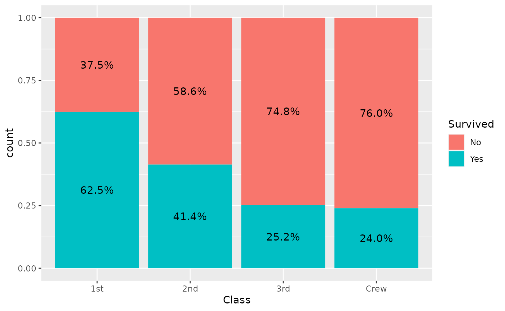

Note that
[`stat_prop()`](https://larmarange.github.io/ggstats/dev/reference/stat_prop.md)
has properly taken into account the **weight** aesthetic.

[`stat_prop()`](https://larmarange.github.io/ggstats/dev/reference/stat_prop.md)
is also compatible with faceting. In that case, proportions are computed
separately in each facet.

``` r
p + facet_grid(cols = vars(Sex))
```

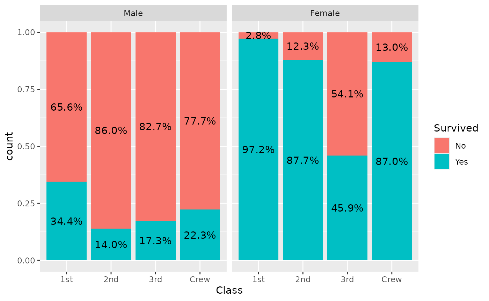

## Displaying proportions of the total

If you want to display proportions of the total, simply map the **by**
aesthetic to `1`. Here an example using a stacked bar chart.

``` r
ggplot(d) +
  aes(x = Class, fill = Survived, weight = Freq, by = 1) +
  geom_bar() +
  geom_text(
    aes(label = scales::percent(after_stat(prop), accuracy = 1)),
    stat = "prop",
    position = position_stack(.5)
  )
```

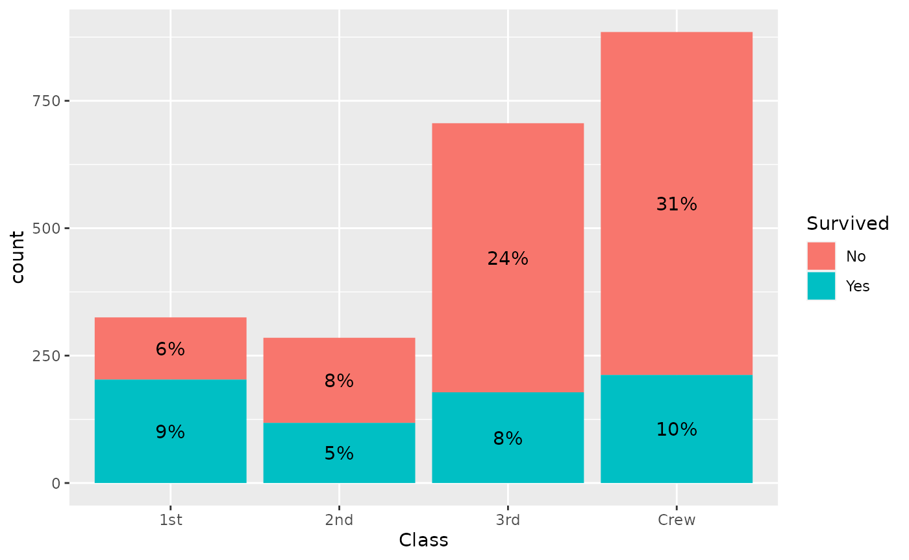

## A dodged bar plot to compare two distributions

A dodged bar plot could be used to compare two distributions.

``` r
ggplot(d) +
  aes(x = Class, fill = Sex, weight = Freq, by = Sex) +
  geom_bar(position = "dodge")
```

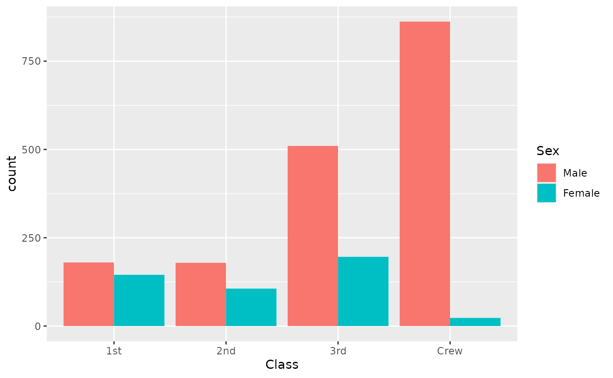

On the previous graph, it is difficult to see if first class is over- or
under-represented among women, due to the fact they were much more men
on the boat.
[`stat_prop()`](https://larmarange.github.io/ggstats/dev/reference/stat_prop.md)
could be used to adjust the graph by displaying instead the proportion
within each category (i.e. here the proportion by sex).

``` r
ggplot(d) +
  aes(x = Class, fill = Sex, weight = Freq, by = Sex, y = after_stat(prop)) +
  geom_bar(stat = "prop", position = "dodge") +
  scale_y_continuous(labels = scales::percent)
```

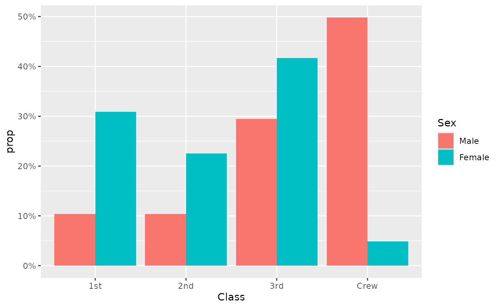

The same example with labels:

``` r
ggplot(d) +
  aes(x = Class, fill = Sex, weight = Freq, by = Sex, y = after_stat(prop)) +
  geom_bar(stat = "prop", position = "dodge") +
  scale_y_continuous(labels = scales::percent) +
  geom_text(
    mapping = aes(
      label = scales::percent(after_stat(prop), accuracy = .1),
      y = after_stat(0.01)
    ),
    vjust = "bottom",
    position = position_dodge(.9),
    stat = "prop"
  )
```

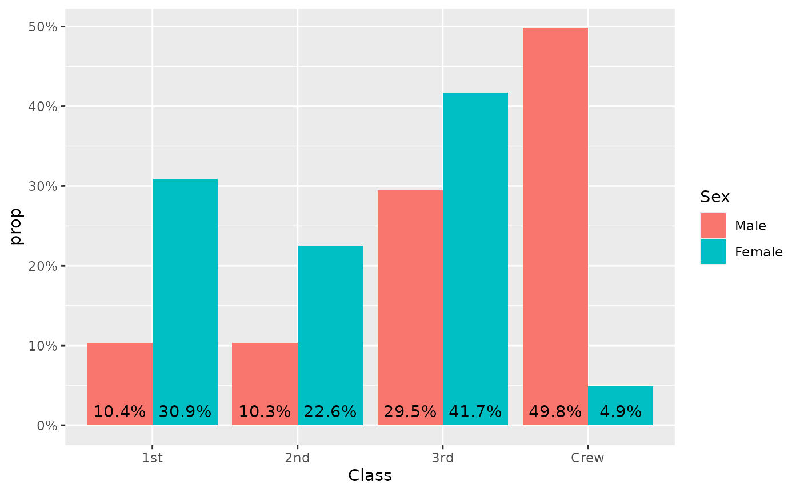

## Displaying unobserved levels

With the `complete` argument, it is possible to indicate an aesthetic
for those statistics should be completed for unobserved values.

``` r
d <- diamonds |>
  dplyr::filter(!(cut == "Ideal" & clarity == "I1")) |>
  dplyr::filter(!(cut == "Very Good" & clarity == "VS2")) |>
  dplyr::filter(!(cut == "Premium" & clarity == "IF"))
p <- ggplot(d) +
  aes(x = clarity, fill = cut, by = clarity) +
  geom_bar(position = "fill")
p +
  geom_text(
    stat = "prop",
    position = position_fill(.5)
  )
```

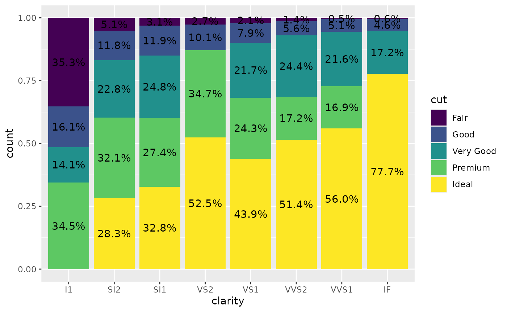

Adding `complete = "fill"` will generate “0.0%” labels where relevant.

``` r
p +
  geom_text(
    stat = "prop",
    position = position_fill(.5),
    complete = "fill"
  )
```

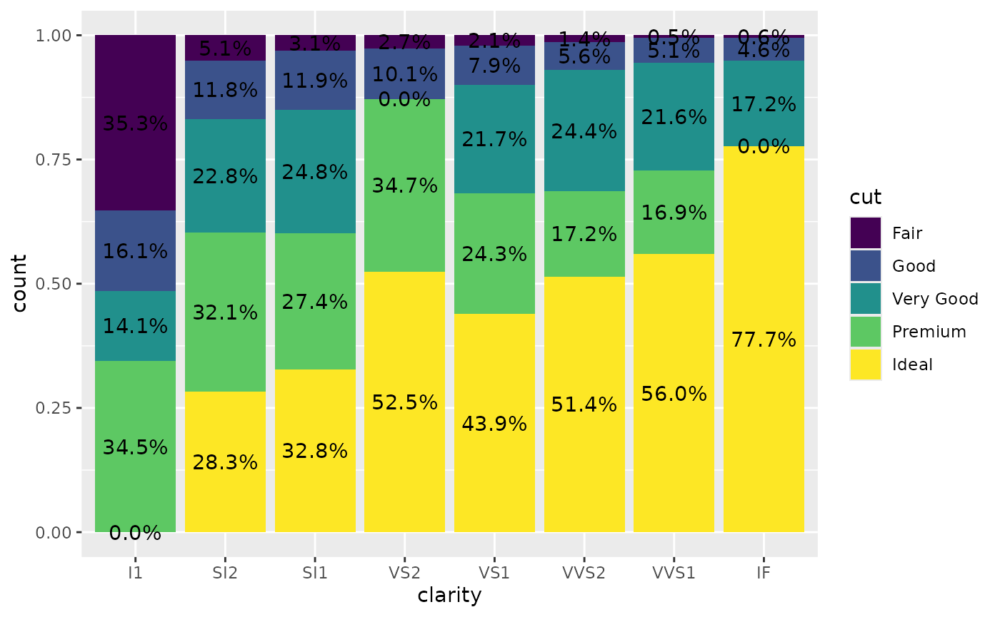

## Using `geom_prop_bar()` and `geom_prop_text()`

The dedicated geometries
[`geom_prop_bar()`](https://larmarange.github.io/ggstats/dev/reference/geom_prop_bar.md)
and
[`geom_prop_text()`](https://larmarange.github.io/ggstats/dev/reference/geom_prop_bar.md)
could be used for quick and easy proportional bar plots. They use by
default
[`stat_prop()`](https://larmarange.github.io/ggstats/dev/reference/stat_prop.md)
with relevant default values. For example, proportions are computed by
**x** or **y** if the `by` aesthetic is not specified. It allows to
generate a quick proportional bar plot.

``` r
ggplot(diamonds) +
  aes(y = clarity, fill = cut) +
  geom_prop_bar() +
  geom_prop_text()
```

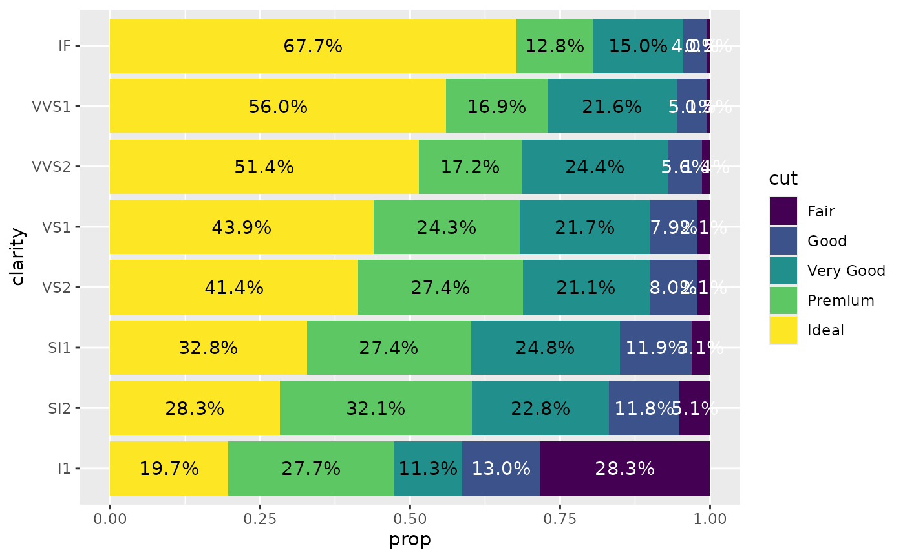

You can specify a `by` aesthetic. For example, to reproduce the
comparison of the two distributions presented earlier.

``` r
d <- as.data.frame(Titanic)
ggplot(d) +
  aes(x = Class, fill = Sex, weight = Freq, by = Sex) +
  geom_prop_bar(position = "dodge") +
  geom_prop_text(
    position = position_dodge(width = .9),
    vjust = - 0.5
  ) +
  scale_y_continuous(labels = scales::percent)
```

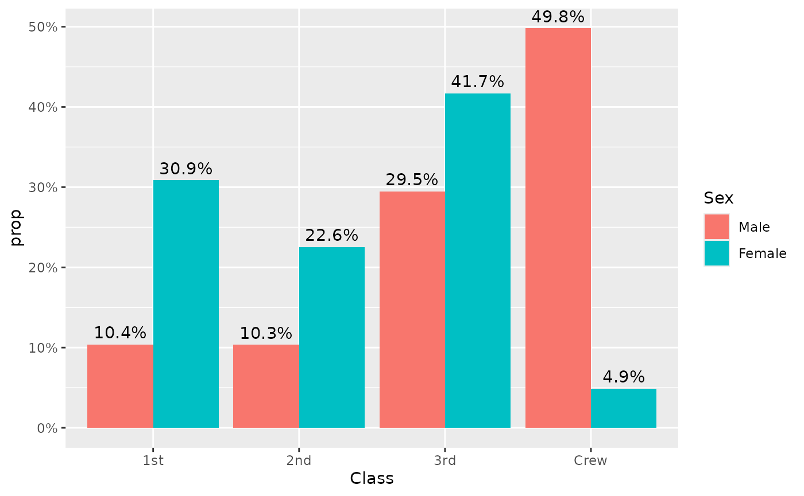

You can also display counts instead of proportions.

``` r
ggplot(diamonds) +
  aes(x = clarity, fill = cut) +
  geom_prop_bar(height = "count") +
  geom_prop_text(
    height = "count",
    labels = "count",
    labeller = scales::number
  )
#> Warning in ggplot2::geom_bar(mapping = mapping, data = data, position =
#> position, : Ignoring unknown parameters: `height`
#> Warning in ggplot2::geom_text(mapping = mapping, data = data, position =
#> position, : Ignoring unknown parameters: `height`, `labels`, and
#> `labeller`
```

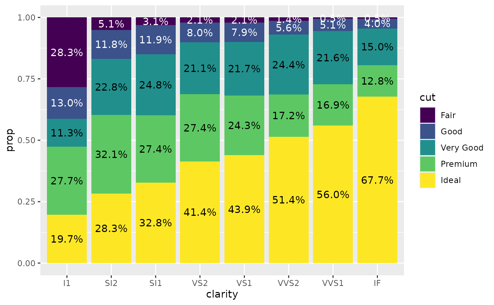
