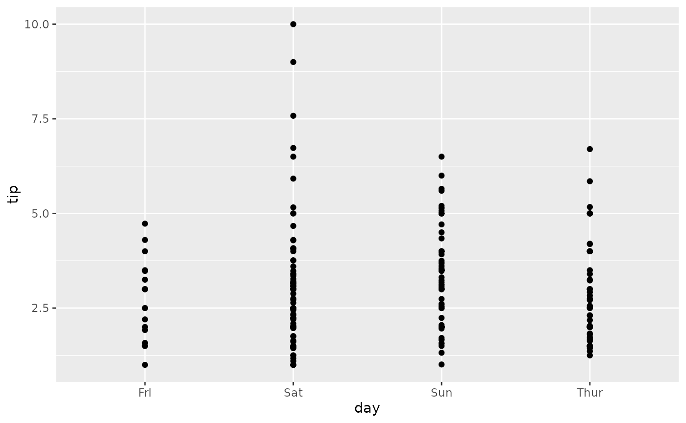
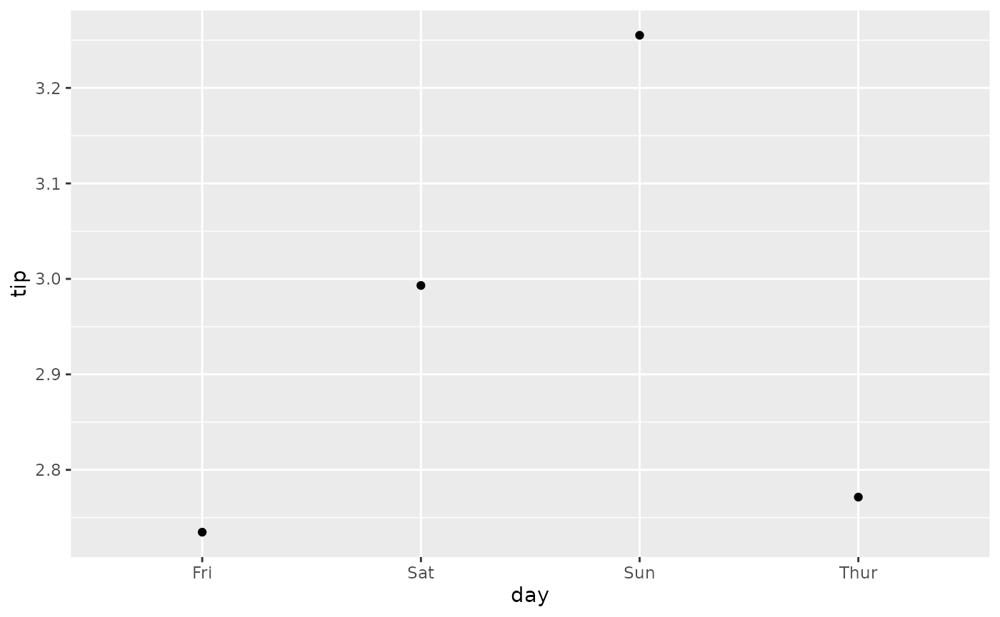
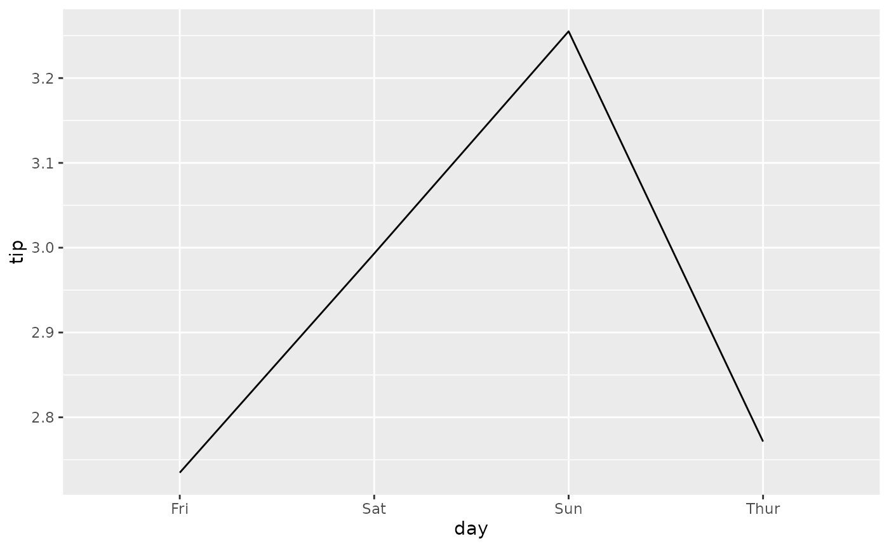
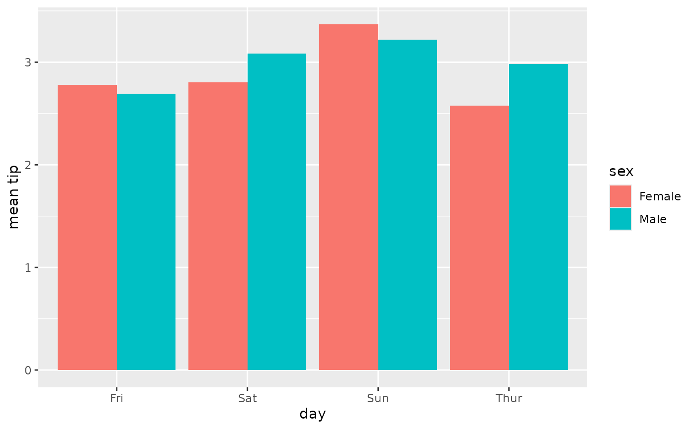
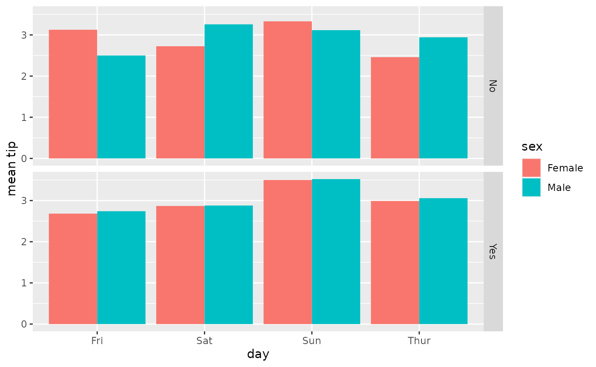
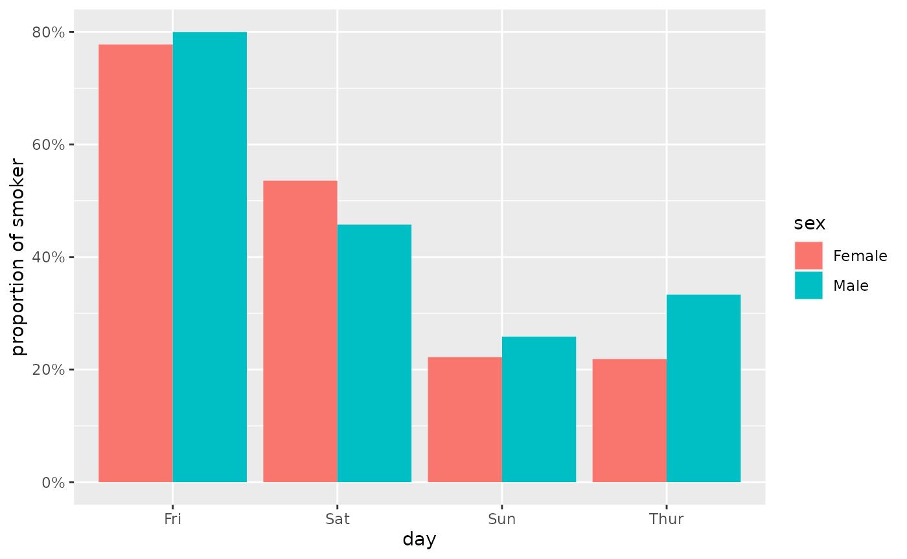
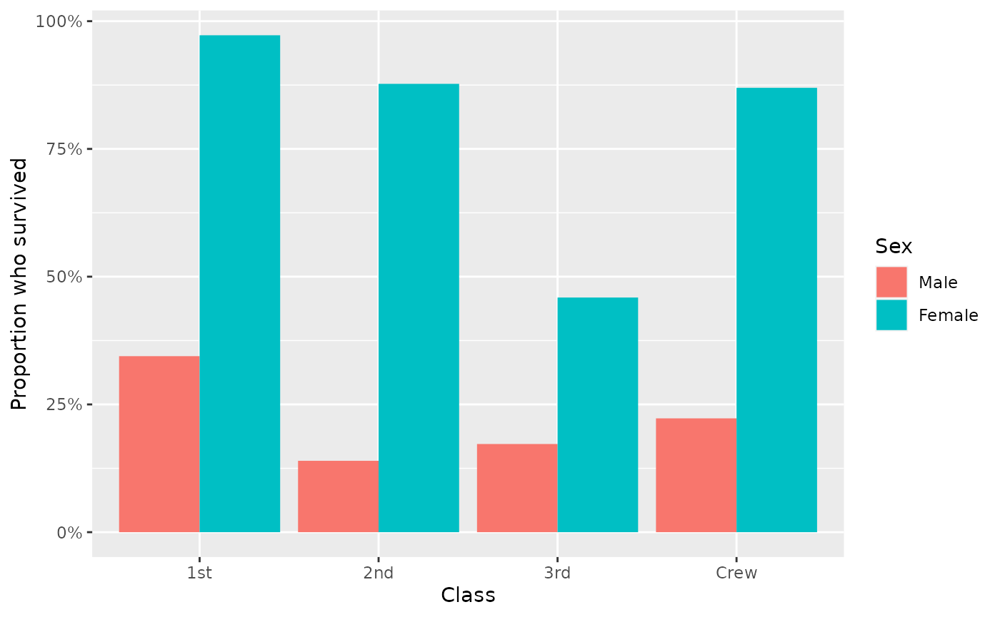

# Compute weighted mean with \`stat_weighted_mean()\`

``` r
library(ggstats)
library(ggplot2)
```

[`stat_weighted_mean()`](https://larmarange.github.io/ggstats/dev/reference/stat_weighted_mean.md)
computes mean value of **y** (taking into account any **weight**
aesthetic if provided) for each value of **x**. More precisely, it will
return a new data frame with one line per unique value of **x** with the
following new variables:

- **y**: mean value of the original **y**
  (i.e. **numerator**/**denominator**)
- **numerator**
- **denominator**

Let’s take an example. The following plot shows all tips received
according to the day of the week.

``` r
data(tips, package = "reshape")
ggplot(tips) +
  aes(x = day, y = tip) +
  geom_point()
```



To plot their mean value per day, simply use
[`stat_weighted_mean()`](https://larmarange.github.io/ggstats/dev/reference/stat_weighted_mean.md).

``` r
ggplot(tips) +
  aes(x = day, y = tip) +
  stat_weighted_mean()
```



We can specify the geometry we want using `geom` argument. Note that for
lines, we need to specify the **group** aesthetic as well.

``` r
ggplot(tips) +
  aes(x = day, y = tip, group = 1) +
  stat_weighted_mean(geom = "line")
```


An alternative is to specify the statistic in
[`ggplot2::geom_line()`](https://ggplot2.tidyverse.org/reference/geom_path.html).

``` r
ggplot(tips) +
  aes(x = day, y = tip, group = 1) +
  geom_line(stat = "weighted_mean")
```



Of course, it could be use with other geometries. Here a bar plot.

``` r
p <- ggplot(tips) +
  aes(x = day, y = tip, fill = sex) +
  stat_weighted_mean(geom = "bar", position = "dodge") +
  ylab("mean tip")
p
```



It is very easy to add facets. In that case, computation will be done
separately for each facet.

``` r
p + facet_grid(rows = vars(smoker))
```



[`stat_weighted_mean()`](https://larmarange.github.io/ggstats/dev/reference/stat_weighted_mean.md)
could be also used for computing proportions as a proportion is
technically a mean of binary values (0 or 1).

``` r
ggplot(tips) +
  aes(x = day, y = as.integer(smoker == "Yes"), fill = sex) +
  stat_weighted_mean(geom = "bar", position = "dodge") +
  scale_y_continuous(labels = scales::percent) +
  ylab("proportion of smoker")
```



Finally, you can use the **weight** aesthetic to indicate weights to
take into account for computing means / proportions.

``` r
d <- as.data.frame(Titanic)
ggplot(d) +
  aes(x = Class, y = as.integer(Survived == "Yes"), weight = Freq, fill = Sex) +
  geom_bar(stat = "weighted_mean", position = "dodge") +
  scale_y_continuous(labels = scales::percent) +
  labs(y = "Proportion who survived")
```


